# Koordlet Design and Architecture

* [Koordlet Design and Architecture](#koordlet-design-and-architecture)
   * [Summary](#summary)
   * [Motivation](#motivation)
      * [Goals](#goals)
      * [Non-Goals](#non-goals)
   * [Architecture](#architecture)
      * [Modules](#modules)
         * [Metrics Advisor](#metrics-advisor)
         * [Storage](#storage)
         * [States Informer](#states-informer)
         * [QoS Manager](#qos-manager)
         * [Metrics Reporter](#metrics-reporter)
         * [Runtime Hooks](#runtime-hooks)
   * [Use Cases](#use-cases)
      * [LLC Isolation Injections during Pod Lifecycle](#llc-isolation-injections-during-pod-lifecycle)
      * [CPU-Suppress on BE Pods to Mitigate Resource Interference](#cpu-suppress-on-be-pods-to-mitigate-resource-interference)

## Summary
Koordlet is a DaemonSet deployed in Kubernetes node, which is used for co-location resource overcommitment, interference 
detection, QoS guarantee, etc. It is composed of several modules which are responsible for information collection, 
data profiling and QoS management independent. Some modules also provides a framework scaffold, which provides a set 
of plugin for extension (such as the "QoS Manager"), so that new strategies can be easily added.  

## Motivation
Many features will be implemented in Koordlet, and new features always import new methods of metric collection, 
strategy algorithm and execution policies. Therefore, a clear definition about the roles and responsibilities of each 
module is necessary, which can avoid making the code bloated the logic more complex.

### Goals
- Define the function of each module.
- Provide developing reference for Koordlet contributors.
- Propose extension points in Koordlet.
- Propose evolution vision of modules in Koordlet.

### Non-Goals 
- Provide usage manual for Koordlet users(e.g. SREs).
- Provide implementation details of modules.

## Architecture

### Modules

#### Metrics Advisor
Metric Advisor provides the basic information of resource usage and performance characteristic of node, pods and containers. 
It is an independent module that collects, processes and exports resource profile periodically. It also detects the 
interference of running containers such as CPU scheduling, memory allocation latency and Pressure Stall Information(PSI).
The information will be widely used for resource overcommitment and QoS guaranteed plugins.

#### Storage
Storage manages the information from Metrics Advisor and States Informer, providing APIs for CURD and GC outdated data 
periodically. There are two types of data: `static` and `time-series`. Time-series type keeps historical data for 
statistics purpose, such as CPU and memory usage. Static type includes the of status information node, pod and container,
such as CPU info of node, metadata of pod.

#### States Informer
States Informer syncs node and pod status from kube-apiserver and kubelet, and saves data into Storage as `static` type.
This module should remain relatively stable over developing iterations compared with others.

#### QoS Manager
QoS Manager coordinates a set of plugins which are responsible for SLO guarantee by priority, mitigating interference 
among pods. Plugins dynamically tunes the "knobs" of resource parameters on different scenarios, according to resource 
profiling, interference detection results and SLO configuration. For each plugin, it always produces execution plans for
"knobs" tuning. QoS Manager also act as an arbitrator among multiple execution plans, consolidating the duplicates and 
resolving the conflicts.

QoS Manager could be the most frequently iterated module, with new plugins extended, strategies algorithm updated and
policy execution ways added. A new plugin should implement the interface which contains a series of standard APIs, so
that the "core" can be kept simple and maintainable. Advanced plugins such as those for interference detection purpose
will get more complex as time goes by, which might becomes an independent module after the incubation has been already
stabled in QoS Manager. 

#### Metrics Reporter
Metrics Reporter reads historical metric and state data from Storage, then merges and sends them to apiserver,
which will be consumed by Koordinator Manager for resource overcommitment model management. Metrics Reporter also 
supports multiple processing algorithms for different co-location scenarios.

#### Runtime Hooks
Runtime Hooks act as the back-end server of Runtime Hook Manager. Runtime Hook Manager is a CRI Proxy, which 
intercepting the CRI request, calling back-end server to inject policies, such as setting resource isolation 
parameters by pod priorities, applying resource allocation policies. Runtime Hooks provide a framework to maintain 
different kinds of policies, and provides flexible extension points during the lifecycle of containers.

## Use Cases
### LLC Isolation Injections during Pod Lifecycle

### CPU-Suppress on BE Pods to Mitigate Resource Interference 

