# Design of Runtime Hook Running Mode in Koordlet

## Summary
`Runtime Hooks` includes a set of plugins which are responsible for the injections of resource isolation parameters 
by pod attribute. When `Koord Runtime Proxy` running as a CRI Proxy, `Runtime Hooks` acts as the backend server. The
mechanism of CRI Proxy can ensure the consistency of resource parameters during pod lifecycle. However, 
`Koord Runtime Proxy` can only hijack CRI requests from kubelet for pods, the consistency of resource parameters in
QoS class directory cannot be guaranteed. Besides, modification of pod parameters from third-party(e.g. manually) will
also break the correctness of hook plugins.

Therefore, a standalone running mode with reconciler for `Runtime Hooks` is necessary. Under `Standalone` running
mode, resource isolation parameters will be injected asynchronously, keeping eventual consistency of the injected
parameters for pod and QoS class even without `Runtime Hook Manager`.

## Goals
- `Runtime Hooks` Framework design for multiple running mode support.
- Detailed design of `standalone` running mode.

## None-Goals
- Implements guide of runtime hook plugins. 

## Architecture


## Framework
There are two running mode in `Runtime Hooks` working at the same time: `proxy` and `standalone`. `Proxy Server` module
is the ingress of `proxy` running mode, receiving Runtime Hook protocol during pod lifecycle. `Reconciler` is for
`standalone` running mode; it will receive events when pod related cgroups files updated. Both module will
convert its requests to internal requests for hook plugins and parse the injections parameters from internal response.
For `proxy` running mode, injections will be wrote back to `Runtime Hook` response, and for `standalone` running mode,
injections will be applied on OS directly.

The internal protocol adapts two running mode inside the hook plugin framework, so that plugin developers does not need 
to rewrite hook functions of pod for different working mode, using the same functions to register. `Reconciler` takes
resource level(QoS class, pod and container) and filename as the input for the maintenance of cgroup resources, and can
be easily extended for more kinds of resources in the future.

## Pod Event in Reconciler
`Reconciler` will register all related files to `Inotify Watcher`, and once the corresponding file has been modified, 
`Inotify Watcher` will sends the event to `Reconciler`. Then, `Reconciler` will update the corresponding file to keep
the consistency.

## Internal Hook Protocol
Internal hook protocol records both the parameters that Runtime Hook Protocol(CRI Protocol) supports and extended
by hook plugins. As for the processing of response, `Proxy Server` converts the CRI related parameters to runtime hook 
protocol and sent back to `Koord Runtime Proxy`, others will be injected to OS; `Reconciler` will injected all
parameters to OS directly.
```go
package hooksprotocol

type PodMeta struct {
	Namespace string
	Name string
	UID string
}

type ContainerMeta struct {
	Name string
}

type ContainerRequest struct {
	PodMeta PodMeta
	ContainerMeta ContainerMeta
	PodLables map[string]string
	PodAnnotations map[string]string
	ContainerAnnotations map[string]string
	PodCgroupParent string
}

type ContainerResponse struct {
	ContainerAnnotations map[string]string
	Resources ContainerResource
}

type ContainerResource struct {
	CPUShares *int64
	CFSQuota *int64
	CPUSet   *string
    CPUBvt   *int64
	// more fields
}
```

## Consistency
`Proxy Server` keeps **strict consistency** during pod creation by intercepting request from kubelet and update the 
resource parameters injected by plugins. While `Reconciler` intercepts asynchronously, it keeps **eventual consistency**
by watching all related files modification and re-injects.