# Design of Runtime Hook Module in Koordlet

* [Design of Runtime Hook Module in Koordlet](#design-of-runtime-hook-module-in-koordlet)
   * [Summary](#summary)
   * [Goals](#goals)
   * [Non-Goals](#non-goals)
   * [Architecture](#architecture)
      * [Modules](#modules)
         * [Hooks](#hooks)
         * [gRPC Server](#grpc-server)
         * [Rule](#rule)
      * [Working Mode](#working-mode)
         * [Proxy](#proxy)
         * [Standalone](#standalone)
   * [Examples for hooks extensions](#examples-for-hooks-extensions)

## Summary
Runtime Hooks acts as the back-end server of Runtime Hook Manager. Runtime Hook Manager is a CRI Proxy, intercepting
the CRI request, calling the back-end server to inject policies, such as setting resource isolation parameters by pod 
priorities, and applying resource allocation policies. Runtime Hooks provides a framework to maintain different kinds 
of policies, and provides flexible extension points during the lifecycle of containers.

## Goals
- Detailed design of runtime hook module.
- Developing reference for runtime hook plugin.

## Non-Goals
- Usage manual for Koordlet users.

## Architecture

### Modules

#### Hooks
`Hooks` module provides a framework for plugins to inject resource parameters for pods and containers. For each new 
implemented plugin, there are two interfaces need to be implemented: 
1. register to `Rule` module for policy configuration management.
2. register to `Hooks` framework for `gRPC Server` calling at corresponding injection stage.

#### gRPC Server
The `gRPC Server` provides the service for runtime injection, which implements the protocol defined by Runtime Manager.
After registered the service endpoint to Runtime Manager, the gRPC Server module will receive requests of different 
injection stage from Runtime Manager, such as `PreRunPodSandboxHook` and `PreStartContainerHook`. For each request,
the gRPC Server will call corresponding plugins to do the injections, fill the protocol parameters 
and response to Runtime Manager.

#### Rule
The `Rule` module is responsible for configuration management, parsing the `NodeSLO` changes and update the local cache
of injection policies. For each policy update, the `Rule` module also provides a callback procedure to refresh the
parameters of pods and containers.  

### Working Mode
Runtime Hooks supports two working modes for different scenarios: `Proxy` and `Standalone`.

 

#### Proxy
`Proxy` is the recommended working mode for Runtime Hooks, which acts as a proxy layer between Kubelet and 
Runtime Service(e.g. Containerd, Docker). With Proxy running mode, users need to change the cri endpoint config 
of Kubelet to `Koordinator Runtime Manager`. For each cri request, `Runtime Manager` will intercept and call
`Runtime Hooks` to execute the injection synchronously. `Proxy` running mode has a better performance which can
guarantee the related parameters set timely and appropriately.

#### Standalone
`Standalone` working mode simplifies the runtime configuration and architecture. `Runtime Manager` is not needed in this 
working mode, so that `Runtime Hooks` works as an independent module. Without the proxy intercepts requests between 
Kubelet and Runtime, `Runtime Hooks` can only set related parameters asynchronously, which limits the using scenarios.  

## Examples for hooks extensions
Group Identity is a kernel feature implemented by Anolis OS, which allows user to configure identities for CPU cgroups
to prioritize tasks in the cgroups. In the mechanism of Koordlet QoS Management, `LS` pods will get higher identity 
than `BE` pods, which is implemented as a plugin in `Runtime Hooks` by setting the cgroup parameters 
at `PreRunPodSandboxHook` stage.