# Design of RuntimeManager

* [Design of RuntimeManager](#summary)
    * [Summary](#summary)
    * [Goals](#goals)
    * [Components](#components)
        * [RuntimeManager](#runtimemanager)
        * [RuntimePlugins](#runtimeplugins)
    * [Architecture of RuntimeManager](#architecture)
        * [CRI Server](#cri-server)
        * [Plugins Manager](#plugins-manager)
        * [Runtime Dispatcher](#runtime-dispatcher)
        * [Store](#store)
    * [RuntimePlugins](#examples-for-hooks-extensions)
        * [How to Register Plugins](#how-to-register-plugins)
        * [Protocols between RuntimeManager and Plugins](#protocols-between-runtimemanager-and-plugins)
        * [Examples for Runtime Plugins](#examples-for-runtime-plugins)
    * [Installation](#installation)

## Summary

RuntimeManager acts as a proxy between kubelet and containerd(dockerd under dockershim scenario), which is designed to
intercept CRI request, and apply some resource management policies, such as setting different cgroup parameters by pod
priorities under hybrid workloads orchestration scenario, applying new isolation policies for latest Linux kernel,
CPU architecture, and etc.

There are two components involved, RuntimeManager and RuntimePlugins.



## Goals

- Enhance resource management for QoS based Scheduling.
- Provide interface for new isolation features which are not supported by CRI.

## Components

### RuntimeManager

RuntimeManager is in charge of intercepting request during pod's lifecycle, such as RunPodSandbox, CreateContainer etc.,
and then calling RuntimePlugins to do resource isolation policies before transferring request to backend containerd(dockerd)
and after transferring response to kubelet. RuntimeManager provides an isolation-policy-execution framework which allows
customized plugins registered to do specified isolation policies, these plugins are called RuntimePlugins.
RuntimeManager itself does NOT do any isolation policies.

### RuntimePlugins

RuntimePlugins register events(RunPodSandbox etc.) to RuntimeManager and would receive notifications when events happen.
RuntimePlugins should complete resource isolation policies basing on the notification message, and then response
RuntimeManager, RuntimeManager would decide to transfer request to backend containerd or discard request according to
plugins' response.

If no RuntimePlugins registered, RuntimeManager would become a transparent proxy between kubelet and containerd.

## Architecture



There are 4 main components for RuntimeManager.

### CRI Server

As a proxy between kubelet and containerd, RuntimeManager acts as a CRI server for kubelet(http server under dockershim
scenario). It should intercept all request from kubelet, and generate protocols for talking with plugins before and
after talking with backend containerd(dockerd)

### Plugins Manager

PluginsManager is in charge of parsing registered plugin info from `/etc/runtime/hookserver.d` dynamically.

### Runtime Dispatcher

RuntimeDispatcher is designed to manage communications with plugins.

### Store

As a proxy, RuntimeManager had better be designed as stateless, but sometimes it does NOT work. Take StartContainer hook
for example, there exists only containerID in CRI StartContainerRequest, which is not enough for plugins to adapt policies
since plugins may not store pod/container info(such as meta, priority) locally. So RuntimeManager should store pod/container
info during RunPodSandbox/CreateContainer Stage. When StartContainer request comes, RuntimeManager can get pod/container info
by containerID, and then call plugins with pod/container info.

With store, there would be pod/container info everytime RuntimeManager calls plugins, so there is no need for plugins to
store pod/container info exceptionally, plugins can be designed as stateless.

Considering performance, store locates in memory and does not generate external io to disk.

## Runtime Plugins

### How to Register Plugins
All the plugin config files should be put to `/etc/runtime/hookserver.d` with `.json` suffix, for example:
```
$ cat /etc/runtime/hookserver.d/koordlet.json
{
    "remote-endpoint": "/var/run/koordlet-runtimehookserver.sock",
    "failure-policy": "Ignore",
    "runtime-hooks": [
        "PreRunPodSandbox"
    ]
}
```
There are 3 fields involved:
- remote-endpoint: endpoint RuntimeManager talking with plugin, generated by plugin.
- failure-policy: policy when calling plugin fail, Fail or Ignore, default to Ignore.
- runtime-hooks: currently 5 hook points: PreRunPodSandbox, PreStartContainer, PostStartContainer, PreUpdateContainerResources,
PostStopContainer.

hook points with prefix 'Pre' means calling plugins before transferring request to contianerd(dockerd).<br>
hook points with prefix 'Post' means calling plugins after receiving response from containerd(dockerd).<br>
plugin provider can set any hook combinations to "runtime-hooks".

### Protocols between RuntimeManager and Plugins
[Protocols](https://github.com/koordinator-sh/koordinator/blob/main/apis/runtime/v1alpha1/api.proto#L141)

### Examples for Runtime Plugins
[koordlet-runtime-plugin-design](https://github.com/koordinator-sh/koordinator/blob/main/docs/design-archive/koordlet-runtime-hooks.md)

## Installation

