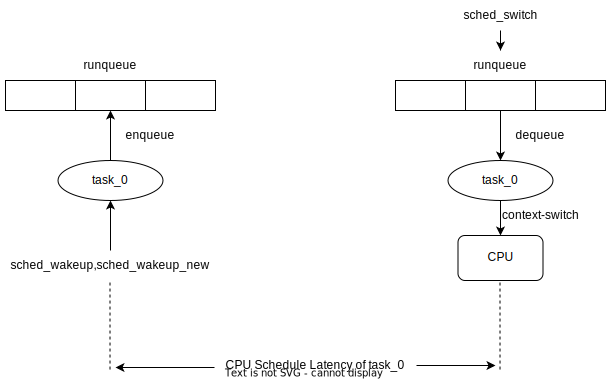
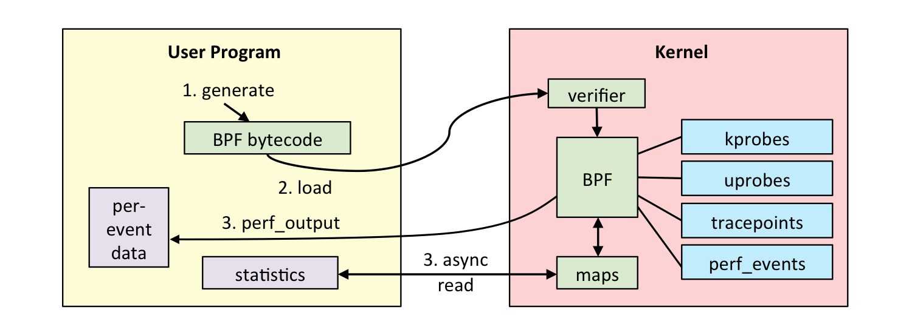

# Collect CPU Schedule Latency by eBPF

## Table of Contents

<!--ts-->
* [Collect CPU Schedule Latency by eBPF](#collect-cpu-schedule-latency-by-ebpf)
   * [Table of Contents](#table-of-contents)
   * [Glossary](#glossary)
   * [Summary](#summary)
   * [Motivation](#motivation)
      * [Goals](#goals)
      * [Non-Goals/Future Work](#non-goalsfuture-work)
   * [Proposal](#proposal)
      * [User Stories](#user-stories)
         * [Story 1](#story-1)
      * [Design](#design)
         * [Computation](#computation)
         * [eBPF](#ebpf)
         * [Use in Go](#use-in-go)
   * [Implementation History](#implementation-history)
   <!--te-->

## Glossary

eBPF, extended Berkeley Packet Filter. See: https://ebpf.io/

cilium/ebpf. See: https://github.com/cilium/ebpf

## Summary

To support Koordinator's Interference Detection feature, CPU schedule latency is considered to be a significant metric. An eBPF methodology to collect CPU schedule latency on single node is proposed to implement this. 

## Motivation

After a linux task(thread) enters the *Runnable* from *Creation* or when running conditions are met (such as the I/O operation is completed), it is now waiting for the allocation of CPU time slices in the runqueue. Scheduling latency refers to the period from when a task is ready to run (enters the CPU's runqueue) to when it is actually executed (obtains the execution right of the CPU). The state transition of this process is shown in the belowing picture with the **Light Green** block to the **Dark Green** block.



This time span depends on whether other tasks are running on the current CPU and the number of tasks queued to run. It is generally believed that the more tasks queued, the longer the scheduling latency may be. So this is also a metric to indirectly measure the CPU load, which is obtained by calculating the number of tasks on the runqueue at each time. In a colocation scenario, other tasks or run queue squeeze will cause the scheduling latency of the expected application process (such as high-priority online tasks) to increase. It can be considered that CPU scheduling latency should be a powerful tool for Interference Detection. 

*eBPF* is a revolutionary technology with origins in the Linux kernel that can run sandboxed programs in an operating system kernel. Today, eBPF is used extensively to drive a wide variety of use cases including extracting fine-grained security observability data at low overhead in cloud native environments. By tracing schedule events using eBPF, we can compute CPU schedule latency easily. 

*cilium/ebpf* is a pure Go library that provides utilities for loading, compiling, and debugging eBPF programs. It has minimal external dependencies and is intended to be used in long running processes.

### Goals

- Define structures, BPF Maps, and working mechanism for eBPF CPU schedule latency collector. 
- Explain workflow of Koordinator and CPU schedule latency collector. 

### Non-Goals/Future Work

- Design external metrics collector framework to run metric collection without Koordlet invasion.
- Define CRD or API for the collector to upload CPU schedule latency. 

## Proposal

### User Stories

#### Story 1

As a cluster administrator, I want to make use of Koordinator's Interference Detection feature to gain better cluster performance. 

### Design

#### Computation

The CPU Schedule Latency is defined as below. Tracepoint `tp/sched/sched_wakeup` and `tp/sched/sched_wakeup_new` indicate one task is enqueued into `runqueue`.  And tracepoint `tp/sched/sched_switch` means one task finishes context switch. 



Notice that there might be many tasks and multiple times of context switch per task in one cgroup. So to compute CPU Schedule Latency on cgroup dimension, we sum all tasks' latency and record the number of latency reported by collector. The final `cgroup's CPU Schedule Latency` is defined as `sum(latency)/num(latency)`. 

For further analysis and more information, the `sum` or `count` is also necessary to report when we want to check the accumulated latency of a cgroup. And based on that, the percentile values are also recorded using an algorithm just like Prometheus `HISTOGRAMS`: users can config buckets' boundaries for CPU schedule latency with `le(less equal)`, and the collector use cumulative counter to record each observation into corresponding bucket. 

To compute one percentile of all observations, use belowing function: 

```go
bucketStart + (bucketEnd-bucketStart)*float64(rank/count)
```

For example, to compute P99 of 10000 observations, we need to know which bucket the 9900th observation is placed in. With cumulative buckets, suppose the 7th bucket contains 9850 records and the 8th bucket contains 9950, we can say that 99% records are under 8th buckets' upper bound( more precisely between 7th upper and 8th upper). Then we know the 9900th record is rank 50 in the 8th bucket, which has 100 counts in it. If the gap of each bucket is 0.2 seconds, then the `bucketStart` equals to `7*0.2`, and `bucketEnd-bucketStart` equals to `0.2`. Then we get the estimated P99 as: 

```go
7 * 0.2 + 0.2 * float64(50 / 100)
```

Notice that the percentile is estamited for sure, and there is bigger error with bigger bucket gap. 

#### eBPF

The work flow of a sample eBPF program is described in the belowing picture. In short, we write eBPF code in .c file, and use clang or llvm to generate bytecode. User program would do eBPF loading to Kernel, which is then proposed to eBPF verifier and JIT compiler to attach to related data sources such as kprobe, uprobe or tracepoints. 



The eBPF program generates tracing datas in Kernel space and use belowing three BPF Maps to communicate with User space program. 

```c
struct {
	__uint(type, BPF_MAP_TYPE_CGROUP_ARRAY);
	__uint(max_entries, 1);
	__type(key, u32);
	__type(value, u32);
} cgroup SEC(".maps");

struct {
	__uint(type, BPF_MAP_TYPE_HASH);
	__uint(max_entries, 10240);
	__type(key, u32);
	__type(value, struct rqeventv2);
} start SEC(".maps");

struct {
	__uint(type, BPF_MAP_TYPE_PERF_EVENT_ARRAY);
	__uint(key_size, sizeof(u32));
	__uint(value_size, sizeof(u32));
} output SEC(".maps");
```

The `BPF_MAP_TYPE_CGROUP_ARRAY` map `cgroup` is used to store `cgroup file descriptors` in user-space for later use to call some helper functions. To collect CPU schedule latency on per `Pod` or `Container` dimension, we use a helper function `bpf_current_task_under_cgroup()` provided by Linux kernel `bpf_helpers` as a filter. It has the ability to check whether the probe is being run is the context of a given subset of the cgroup.  

When events of probe `tp/sched/sched_wakeup` or `tp/sched/sched_wakeup_new` arrive, the current timestamp need to be recorded and stored in the `BPF_MAP_TYPE_HASH` map `start` with key of its `pid` . And when events of probe `tp/sched/sched_switch` arrive, we try to get elements from map `start` by the same key `pid`. If it exists, the current timestamp is subtracted by the start timestamp as one record of schedule latency. This delta is put into the `BPF_MAP_TYPE_PERF_EVENT_ARRAY` map which is further read by user-space go program. 

To implement the above process, some other structure need to be defined to catch and handle corresponding events. 

Belowing `sched_wakeup_args` and `sched_switch_args` is defined as the format in `/sys/kernel/debug/tracing/events/sched/{$probe_name}/format` file. And `trace_entry` is the common part of them. 

```c
struct trace_entry {
	short unsigned int type;
	unsigned char flags;
	unsigned char preempt_count;
	int pid;
};

struct sched_wakeup_args {
	struct trace_entry ent;
	char comm[16];
	pid_t pid;
	int prio;
	int success;
	int target_cpu;
	char __data[0];
};

struct sched_switch_args {
	struct trace_entry ent;
	char prev_comm[16];
	pid_t prev_pid;
	int prev_prio;
	long int prev_state;
	char next_comm[16];
	pid_t next_pid;
	int next_prio;
	char __data[0];
};
```

Then we need to implement belowing three handle functions to trace these tracepoints. 

```c
SEC("tp/sched/sched_wakeup")
int handle__sched_wakeup(struct sched_wakeup_args *ctx)
{
	return 0;
}

SEC("tp/sched/sched_wakeup_new")
int handle__sched_wakeup_new(struct sched_wakeup_args *ctx)
{
  return 0;
}

SEC("tp/sched/sched_switch")
int handle_switch(struct sched_switch_args *ctx)
{
	return 0;
}
```

#### Sampling method

The eBPF program traces all events from the kernel tracepoints and then determines whether those events belong to the target cgroup. It is possible to configure a sampling ratio to reduce the collection overhead even this sampling mechanism is surely leading to precision drops. We assume that it is acceptable to some extent and is worth doing. 

So this is a classic sampling problem for stream data with a fixed proportion. Take the sampling rate as 10%, a naive solution is to generate a random integer in [0..9] for each element, and store the query if the integer is 0, otherwise discard. To be more specific, this filter process will be performed when a `handle__sched_wakeup` or `handle__sched_wakeup_new` is triggered. A bpf map can be created to take over the sampling rate: 

```c
struct args {
	u64 sampling_rate;
};

struct {
	__uint(type, BPF_MAP_TYPE_ARRAY);
	__uint(max_entries, 4);
	__type(key, u32);
	__type(value, struct args);
} argmap SEC(".maps");
```

Another possible method to randomly sample is hashing by timestamps. Take the sampling rate as 30%, every time the handle funtions are triggered, we get the current timestamp and compute the hash value of this data as `timestamp % 10 `, which divide datas into 10 buckets. And only datas placed in bucket 0-2 will be recorded eventually. 

Anyway, we strongly suggest that further evaluation must be performed in the future and trade-offs of precision and overhead controlling need to be considered before the sampling method implemented in eBPF CPU schedule latency program. 

#### Use in Go

cilium/ebpf helps us to generate corresponding go code and compile eBPF program into ELF by use the comment like belowing: 

```go
// $BPF_CLANG and $BPF_CFLAGS are set by the Makefile.
//go:generate go run github.com/cilium/ebpf/cmd/bpf2go -cc $BPF_CLANG -cflags $BPF_CFLAGS bpf ${bpf_program_file} -- -I./headers
```

And we need to implement a Go program doing eBPF loading, attaching, reading outputs and handle metrics. 

```go
func GetCPUScheduleLatency(cgroupPathFd int) {
	// Allow the current process to lock memory for eBPF resources.
	if err := rlimit.RemoveMemlock(); err != nil {
		log.Fatal(err)
	}

	// Load pre-compiled programs and maps into the kernel.
	objs := bpfObjects{}
	if err := loadBpfObjects(&objs, nil); err != nil {
		log.Fatalf("loading objects: %v", err)
	}
	defer objs.Close()
	
	// Put target cgroup fd into cgroup Map
	objs.Cgroup.Put(0, int(fd))

	// Open a tracepoint and attach the pre-compiled program.
	// The first two arguments are taken from the following pathname:
	// /sys/kernel/debug/tracing/events/sched/sched_wakeup
	tpWakeup, err := link.Tracepoint("sched", "sched_wakeup", objs.HandleSchedWakeup, nil)
	if err != nil {
		log.Fatalf("opening tracepoint: %s", err)
	}
	defer tpWakeup.Close()

	tpWakeupNew, err := link.Tracepoint("sched", "sched_wakeup_new", objs.HandleSchedWakeupNew, nil)
	if err != nil {
		log.Fatalf("opening tracepoint: %s", err)
	}
	defer tpWakeupNew.Close()

	tpSwitch, err := link.Tracepoint("sched", "sched_switch", objs.HandleSwitch, nil)
	if err != nil {
		log.Fatalf("opening tracepoint: %s", err)
	}
	defer tpSwitch.Close()

	// Open a perf reader from userspace into the perf event array
	// created earlier.
	rd, err := perf.NewReader(objs.Output, os.Getpagesize())
	if err != nil {
		log.Fatalf("creating event reader: %s", err)
	}
	defer rd.Close()

	// Read and handle metrics in a specific timewindow
	ticker := time.NewTicker(TimeWindow)
	defer ticker.Stop()

	// Other handle tasks. 
	...
}
```

## Implementation History

- [x] 05/12/2022: Open PR for initial draft
