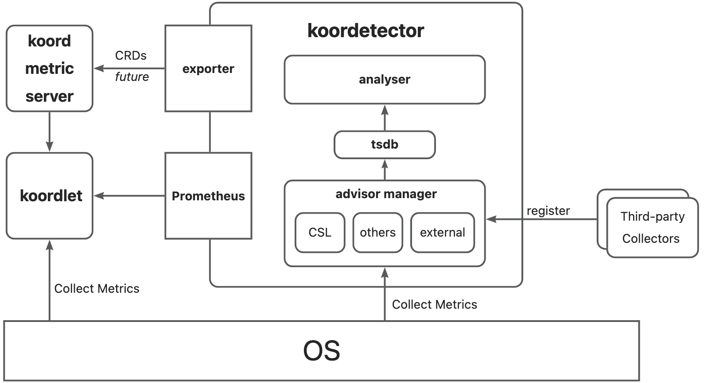

# New sub-repository Koordetector

## Table of Contents

<!--ts-->
* [New sub-repository Koordetector](#new-sub-repository-koordetector)
   * [Table of Contents](#table-of-contents)
   * [Glossary](#glossary)
   * [Summary](#summary)
   * [Motivation](#motivation)
      * [Goals](#goals)
      * [Non-Goals/Future Work](#non-goalsfuture-work)
   * [Proposal](#proposal)
      * [User Stories](#user-stories)
         * [Story 1](#story-1)
         * [Story 2](#story-2)
      * [Design](#design)
   * [Implementation History](#implementation-history)
<!--te-->   

## Glossary

eBPF, extended Berkeley Packet Filter. See: https://ebpf.io/

OpenAnolis: https://gitee.com/anolis

Prometheus: https://prometheus.io/

## Summary

To support Koordinator's Interference Detection feature, some advanced metrics need to be collected by multiple technologies such as CPU schedule latency by eBPF. This proposal is intended to develop a new sub-repo for Koodinator named `Koordetector` which covers many underlying kernel metrics collection tools implemented with eBPF technology or others, and expands Koordinator's ability to collect metrics in the form of plug-ins. Besides, Koordetector should also do some jobs about metric analysis, and draw a conclusion about whether some pods get interference. 

## Motivation

Enlighted by encapsulating the eBPF program of the CPU schedule latency collector into a separate tool, we noticed that Koordinator may better develop a new sub-repo to do this kind of jobs independently. On one hand,  given that the eBPF technology itself is in a stage of rapid development, and it has also attracted a lot of attention from kernel workers, Koordinator can use such sub-repo as a cutting edge for exploration in this regard. Furthermore, the sub-repo can be connected to mature third-party monitoring tools such as the `SysAK` project of the OpenAnolis community. Therefore, the proposal aims to decouple the ability of Koordinator to collect the underlying indicators of the kernel, and leave the professional work to professional people.

When it comes to interference detection and solving, it should include several steps: metrics collection, metrics analysis and strategy execution. The new sub-repo can do more than just metrics collection, but also analysis. That's why we can name this repo as `Koordetector`. The special part of metrics collection in Koordetctor is that it provides **advanced metrics** like `CPU schedule latency`, `memory allocation latency`, `cache miss`, which are either related to underlying OS or need to be collected by advanced methods like eBPF. And there possibly is no need to do migration for current metrics collected by `Koodlet`. 

The responsibilities of `Koordetector` and `Koordlet` are:

- `Koordetector`: metrics collection and analysis, and draws a conclusion about whether some pods get interference
- `Koordlet`: receive the result of interference detection from `Koordetector` committed strategy(resource suppress/evict)

### Goals

- Define the concepts, responsibilities and basic structure of the new repo `Koordetector`

### Non-Goals/Future Work

- [Future Plan] Design metric reporting CRDs or APIs. 

## Proposal

### User Stories

#### Story 1

As a Koordinator developer, I want to commit my own metric collector implementation to enhance Koordlet's ability to collect advanced metrics for interference detection.

#### Story 2

To use Koordinator better, I want to adapt third-part tools for extension.

### Design



The whole structure of `Koordetector` contains belowing several components to realise our motivation: 

`advisor manager`: manage a set of metrics collector, and also support external tools as prometheus format. The struct `CollectorManager` manages all collectors with feature-gates.  The struct `AdvisorManager` manages all collectors with feature-gates. 

`AdvisorContext` contains `StateInformer` and `MetricsCache` and will be used as a parameter of `InitAdvisor` function during collector initialization. Each collector should implement interface `Advisor` which contains some basic methods, such as `Name()`, `Run()`, `Stop()`, etc. 

`ExternalAdvisor` use `URL()` method to register third-party metrics server `IP:PORT` to use possible http metrics collection services. 

```go
// AdvisorManager
type AdvisorManager struct {
	FeatureList map[CollectorName]bool
	CollectorList map[CollectorName]*Collector
}

type AdvisorContext interface {
	StatesInformer
	MetricCache
}

// Advisor Initialization
func InitAdvisor(ctx CollectorContext) Plugin { 
	// ...
}

type Advisor interface {
	Name() string
	Run(stop <-chan struct{}) ()
	Stop() error
}

type ExternalAdvisor interface {
	Name() string
	URL()  string
	Run(stop <- chan struct{}) ()
	Stop() error
}
```

`tsdb`: cache data for analysis.
`analyser`: analyse metrics to detect interference.
`exporter`: expose data API for koordlet, and report to `koord metric server` in the future.


At the very beginning of metrics collection and interference detection, the metrics collected are reported by Prometheus as below. 

```go
Metric = prometheus.NewGaugeVec(prometheus.GaugeOpts{
	Subsystem: "koordetector",
  	Name:      "metric_name", 
	Help:      "help information",
}, []string{NodeKey, ContainerID, ContainerName, PodUID, PodName, PodNamespace})
```

## Implementation History

- [x] 05/12/2022: Open PR for initial draft

