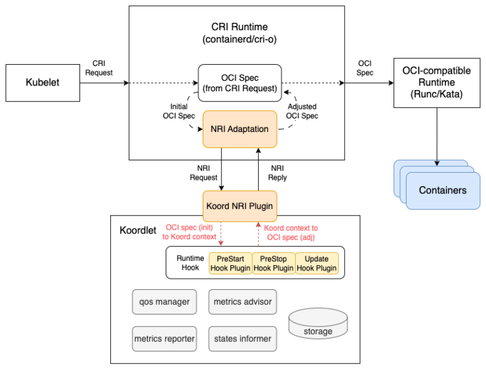
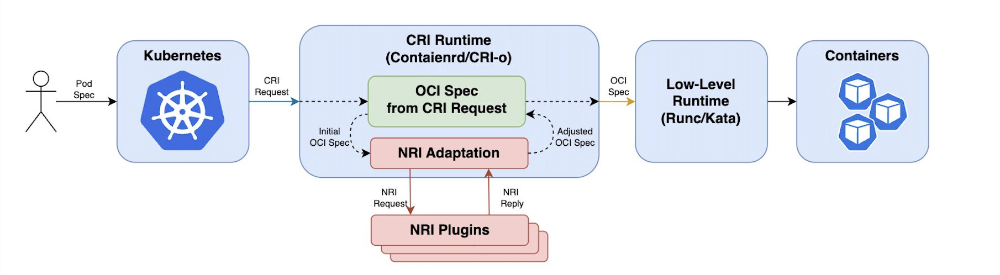

# NRI Mode Resource Management

## Table of Contents


Table of Contents
=================

* [NRI Mode Resource Management](#nri-mode-resource-management)
    * [Table of Contents](#table-of-contents)
    * [Glossary](#glossary)
    * [Summary](#summary)
    * [Motivation](#motivation)
        * [Goals](#goals)
        * [Non-Goals/Future Work](#non-goalsfuture-work)
    * [Proposal](#proposal)
        * [User Stories](#user-stories)
            * [Story 1](#story-1)
            * [Story 2](#story-2)
            * [Story 3](#story-3)
            * [Story 4](#story-4)
        * [Requirements (Optional)](#requirements-optional)
            * [Functional Requirements](#functional-requirements)
            * [Non-Functional Requirements](#non-functional-requirements)
        * [Implementation Details/Notes/Constraints](#implementation-detailsnotesconstraints)
        * [Risks and Mitigations](#risks-and-mitigations)
    * [Alternatives](#Alternatives)
    * [Upgrade Strategy](#upgrade-strategy)
        * [Test Plan [optional]](#test-plan-optional)
    * [Implementation History](#implementation-history)


## Glossary

NRI, node resource interface. See: https://github.com/containerd/nri

## Summary

We hope to enable NRI mode resource management for koordinator for easy deployment and in-time control. 

## Motivation

Koordinator as a QoS based scheduling system for hybrid workloads orchestration on Kubernetes and its runtime hooks support two working [modes](https://github.com/koordinator-sh/koordinator/blob/main/docs/design-archive/koordlet-runtime-hooks.md) for different scenarios: `Standalone` and `Proxy`. However, both of them have some [constraints](https://shimo.im/docs/m4kMLdgO1LIma9qD). NRI (Node Resource Interface), which is a public interface for controlling node resources is a general framework for CRI-compatible container runtime plug-in extensions. It provides a mechanism for extensions to track the state of pod/containers and make limited modifications to their configuration. We'd like to integrate NRI framework to address `Standalone` and `Proxy` constraints based on this community recommend mechanism.

### Goals

- Support NRI mode resource management for koordinator.
- Support containerd container runtime.

### Non-Goals/Future Work

- Support docker runtime

## Proposal

Different from standalone and proxy mode, Koodlet will start an NRI plugin to subscribe pod/container lifecycle events from container runtime (e.g. containerd, crio), and then koordlet NRI plugin will call runtime hooks to adjust pod resources or OCI spec. The flow should be:

- Get pod/container lifecycle events and OCI format information from container runtime (e.g. containerd, crio).
- Transform the OCI format information into internal protocols. (e.g. PodContext, ContainerContext) to re-use existing runtime hook plugins.
- Transform the runtime hook plugins' response into OCI spec format 
- Return OCI spec format response to container runtime(e.g. containerd, crio).



### User Stories

#### Story 1
As a cluster administrator, I want to apply QoS policy before pod's status become running.

#### Story 2
As a cluster administrator, I want to deploy koordinator cluster without restart.

#### Story 3
As a cluster administrator, I want to adjust resources' policies at runtime.

#### Story 4
As a GPU user, I want to inject environment before pod running.

### Requirements (Optional)

- Need to upgrade containerd to >= 1.7.0, crio to v1.25.0

#### Functional Requirements

NRI mode should support all existing functionalities supported by standalone and Proxy mode.

#### Non-Functional Requirements

Non-functional requirements are user expectations of the solution. Include
considerations for performance, reliability and security.

### Implementation Details/Notes/Constraints
1. koordlet [NRI plugin](https://github.com/containerd/nri/blob/main/plugins/template/plugin.go)
```go
type nriServer struct {
	stub    stub.Stub
	mask    stub.EventMask
	options Options // server options
}

// Enable 3 hooks (RunPodSandbox, CreateContainer, UpdateContainer) in NRI 
func (p *nriServer) Configure(config, runtime, version string) (stub.EventMask, error) {
}

// Sync all pods/containers information before koordlet nri plugin run
func (p *nriServer) Synchronize(pods []*api.PodSandbox, containers []*api.Container) ([]*api.ContainerUpdate, error) {
}

func (p *nriServer) RunPodSandbox(pod *api.PodSandbox) error {
	podCtx.FromNri(pod)
	RunHooks(...)
	podCtx.NriDone()
}

func (p *nriServer) CreateContainer(pod *api.PodSandbox, container *api.Container) (*api.ContainerAdjustment, []*api.ContainerUpdate, error) {
    containerCtx.FromNri(pod, container)
	RunHooks(...)
	containCtx.NriDone()
}

func (p *nriServer) UpdateContainer(pod *api.PodSandbox, container *api.Container) ([]*api.ContainerUpdate, error) {
	containerCtx.FromNri(pod, container)
	RunHooks(...)
	containCtx.NriDone()
}
```
2. koordlet enhancement for NRI
- PodContext
```go
// fill PodContext from OCI spec
func (p *PodContext) FromNri(pod *api.PodSandbox) {
}

// apply QoS resource policies for pod
func (p *PodContext) NriDone() {
}
```
- ContainerContext
```go
// fill ContainerContext from OCI spec
func (c *ContainerContext) FromNri(pod *api.PodSandbox, container *api.Container) {
}

// apply QoS resource policies for container
func (c *ContainerContext) NriDone() (*api.ContainerAdjustment, []*api.ContainerUpdate, error) {
}
```

### Risks and Mitigations

## Alternatives
There are several approaches to extending the Kubernetes CRI (Container Runtime Interface) to manage container resources such as `standalone` and `proxy`. Under `standalone` running mode, resource isolation parameters will be injected asynchronously. Under `proxy` running mode, proxy can hijack CRI requests from kubelet for pods and then apply resource policies in time. However, `proxy` mode needs to configure and restart kubelet.

- Standalone

  - kubelet -- CRI Request -> CRI Runtime -- OCI Spec -> OCI compatible runtime -> containers
  - kubelet -> Node Agent -> CRI Runtime / containers


- Proxy

  - kubelet -- CRI Request -> CRI Proxy -- CRI Request (hooked) -> CRI Runtime -- OCI Spec -> OCI compatible runtime -> containers


- NRI

  - kubelet -- CRI Request -> CRI Runtime -- OCI Spec --> OCI compatible runtime -> containers  
  &emsp;&emsp;&emsp;&emsp;&emsp;&emsp;&emsp;&emsp;&emsp;&emsp;&emsp;&emsp;&emsp;&emsp; $\searrow$ &emsp; $\nearrow$  
  &emsp;&emsp;&emsp;&emsp;&emsp;&emsp;&emsp;&emsp;&emsp;&emsp;&emsp;&emsp;Koordlet NRI plugin



## Upgrade Strategy

- Need to upgrade containerd to 1.7.0+ or CRIO to 1.25.0+
- Need to enable NRI

### Test Plan [optional]

## Implementation History

- [ ] 04/04/2023: Proposed idea [community meeting](https://shimo.im/docs/m4kMLdgO1LIma9qD)
- [ ] 05/08/2023: Post a [discussion](https://github.com/koordinator-sh/koordinator/discussions/1276) and [issue](!https://github.com/koordinator-sh/koordinator/issues/1277) at github
- [ ] 06/08/2023: Open proposal PR

