# QoS Manager

## Table of Contents

<!--ts-->

* [QoS Manager](#qos-manager)
  * [Table of Contents](#table-of-contents)
  * [Summary](#summary)
  * [Motivation](#motivation)
    * [Goals](#goals)
    * [Non-Goals/Future Work](#non-goalsfuture-work)
  * [Proposal](#proposal)
    * [Design](#design)
  * [References](#references)

<!--te-->

## Summary

QoS Manager is a new plugin framework for `dynamic plugins` in [issue](https://github.com/koordinator-sh/koordinator/issues/174), `static plugins` will be move into [RuntimeHooks](https://github.com/koordinator-sh/koordinator/blob/main/docs/design-archive/koordlet-runtime-hooks.md).


## Motivation

Currently, plugins from resmanager in Koordlet are mixed together, they should be classified into two categories: `static` and `dynamic`. Static plugins will be called and run only once when a container created, updated, started or stopped. However, for dynamic plugins, they may be called and run at any time according the real-time runtime states of node, such as CPU suppress, CPU burst, etc. This proposal only focuses on refactoring dynamic plugins. Take a look at current plugin implementation, there are many function calls to resmanager's methods directly, such as collecting node/pod/container metrics, fetching metadata of node/pod/container, fetching configurations(NodeSLO, etc.). In the feature, we may need a flexible and powerful framework with scalability for special external plugins.

### Goals
- Define a new framework named `qos-manager` to manage dynamic plugins.
- Define new interfaces to abstract and simplify management of plugins.
- Refactor and move the built-in dynamic plugins into `qos-manager`, such as `CPU suppress`, `CPU brust`, `CPU evict` and `memory evict`.

### Non-Goals/Future Work

- [Future Plan] Framework design with scalability for external plugins.
- [Future Plan] Refctor `resource-update-executor`.

## Proposal
### Design



 The below is directory tree of qos-manager inside koordlet, all existing dynamic plugins(as built-in plugins) will be move into sub-directory `plugins`.
 
```
pkg/koordlet/qosmanager/
                       - manager.go
                       - context.go   // plugin context
                       - /plugins/    // built-in plugins
                                 - /cpubrust/
                                 - /cpusuppress/
                                 - /cpuevict/
                                 - /memoryevict/
```

The struct `QoSManager` wraps `resmanager` to provide necessary interface methods for all plugins, here we just put `StateInformer`, `MetricsCache` and `Executor` into a `PluginContext` as a parameter of `InitPlugin` function during plugin initialization. Each plugin should implement interface `Plugin` which contains some basic methods, such as `Name()`, `Run()`, `Stop()`, etc. On startup, each plugin should call `StateInformer.RegisterCallbacks` for `NodeSLO` policy updates. Additionally, QoSManager is also responsible for managing plugin feature-gates. 

The `Executor` is a very important component in `Koordlet` which is responsible for resolving conflicts of rules produced by `qos-manager` and `runtime-hooks`, adaptations for various platforms (kernel, arch, etc.), it also should have a configuration cache to avoid redundant parameters updates.

```go

// QoSManager
type QoSManager struct {
    *resmanager
    // ...
}

type PluginContext interface {
    StatesInformer
    MetricCache
    Executor
}

// Plugin Initialization
func InitPlugin(ctx PluginContext) Plugin {
    // ...
}

type Plugin interface {
    Name() string
    Run(stop <-chan struct{}) ()
    Stop() error
}
```

## References
1. [Design of Runtime Hook Module in Koordlet](https://github.com/koordinator-sh/koordinator/blob/main/docs/design-archive/koordlet-runtime-hooks.md)
