## Table of Contents


- [Title](#title)
  - [Table of Contents](#table-of-contents)
  - [Glossary](#glossary)
  - [Motivation](#motivation)
    - [Goals](#goals)
    - [Non-Goals/Future Work](#non-goalsfuture-work)
  - [Proposal](#proposal)
    - [Design](#design)
    - [Collect idle memory info and insert memory with hot page](#collect-idle-memory-info-and-insert-memory-with-hot-page)
	- [Report memory usage including hot page](#report-memory-usage-including-hot-page)
	- [Define cold memory API](#define-cold-memory-api)

## Glossary

**cold page**

A cold page is a page that keeps idle for a long time in the page cache.

**hot page**

A cold page is a page that is often used in the page cache.

**kidled**

Kided, an open source cold memory collection solution, identifies the hot and cold conditions of nodes, pod and container memory in the cluster. 

## Summary

To support more fine-grained memory overselling, incorporate cold memory compute into memory usage in koordinator.

## Motivation

Currently, the memory usage of nodes and pods collected by koordlet does not contain page cache. It is too aggressive. There are many hot pages that should be counted as memory usage in page cache .That will also help identify cold page and more fine-grained oversell memory. This proposal focuses on cold memory collection and report. 

### Goals

- Define a new util struct named idleinfo  to collect idle memory info.
- Informer report memory usage of including hot page and crd nodemetric will update status.
- Collect cold and hot condition  in node, pod and contain and insert metric in metriccache.

### Non-Goals/Future Work

- Cold memory supports  scheduling optimization in koord-manager or koord-scheduler.

## Proposal

### Design

#### Collect idle memory info and insert memory with hot page



Cold memory is idle pages in page cache. This proposal applies kidled to collect idle pages. Kidled will export a file named memory.idle_stat which includes idle page. The file will exist at each hierarchical of cgroup memory. The process of collect idle memory is as shown in figure. First, kidled exports memory.idle_stat file. Second, the corresponding collector(noderesource and podresource) will collect idle info and insert metric.

The proposal add a file idleinfo.go in pkg/koordlet/util/idleinfo.go

Define an Idleinfo struct as follows. It corresponds to this memory.idle_stat file information.

```go
type IdleInfo struct {
	Version             string   `json:"version"`
	PageScans           uint64   `json:"page_scans"`
	SlabScans           uint64   `json:"slab_scans"`
	ScanPeriodInSeconds uint64   `json:"scan_period_in_seconds"`
	UseHierarchy        uint64   `json:"use_hierarchy"`
	Buckets             []uint64 `json:"buckets"`
	Csei                []uint64 `json:"csei"`
	Dsei                []uint64 `json:"dsei"`
	Cfei                []uint64 `json:"cfei"`
	Dfei                []uint64 `json:"dfei"`
	Csui                []uint64 `json:"csui"`
	Dsui                []uint64 `json:"dsui"`
	Cfui                []uint64 `json:"cfui"`
	Dfui                []uint64 `json:"dfui"`
	Csea                []uint64 `json:"csea"`
	Dsea                []uint64 `json:"dsea"`
	Cfea                []uint64 `json:"cfea"`
	Dfea                []uint64 `json:"dfea"`
	Csua                []uint64 `json:"csua"`
	Dsua                []uint64 `json:"dsua"`
	Cfua                []uint64 `json:"cfua"`
	Dfua                []uint64 `json:"dfua"`
	Slab                []uint64 `json:"slab"`
}
```

Define a function named readIdleInfo(). It read idleinfo memory.idle_stat and return an idleinfo object.

```go
func readIdleInfo(path string) (*IdleInfo, error) {
    //read file process  omit concrete process
    return &info, nil
}
```

Define a function named GetIdleInfoFilePath(). It is uesd to return idleinfo file path.(node e.g. /sys/fs/cgroup/memory/memory.idle_stat)

```go
func GetIdleInfoFilePath(idleFileRelativePath string) string {
	return filepath.Join(system.Conf.CgroupRootDir, idleFileRelativePath, IdleInfoName)
}
```

Define a function named GetIdleMemoryTotalKB(). It is uesd to return size of total idle page. The unit is byte.

```go
func GetIdleMemoryTotalKB(idleFileRelativePath string) (uint64, error) {
	idleinfoPath := GetIdleInfoFilePath(idleFileRelativePath)
	idleInfo, err := readIdleInfo(idleinfoPath)
	if err != nil {
		return 0, err
	}
	sum := func(nums ...[]uint64) uint64 {
		var total uint64
		for _, v := range nums {
			for _, num := range v {
				total += num
			}
		}
		return total
	}
	return sum(idleInfo.Csei, idleInfo.Dsei, idleInfo.Cfei, idleInfo.Dfei, idleInfo.Csui, idleInfo.Dsui, idleInfo.Cfui, idleInfo.Dfui, idleInfo.Csea, idleInfo.Dsea, idleInfo.Cfea, idleInfo.Dfea, idleInfo.Csua, idleInfo.Dsua, idleInfo.Cfua, idleInfo.Dfua, idleInfo.Slab), nil
}
```

Add two functions  in pkg/koordlet/util/meminfo.go  to get node's MemTotal and MemFree. The values are used to compute Mem usage with hot page.

```go
// GetMemTotalKB returns the node's memory total quantity (kB)
func GetMemTotalKB() (int64, error) {
	meminfoPath := system.GetProcFilePath(system.ProcMemInfoName)
	memInfo, err := readMemInfo(meminfoPath)
	if err != nil {
		return 0, err
	}
	usage := int64(memInfo.MemTotal)
	return usage, nil
}

// GetMemFreeKB returns the node's memory free quantity (kB)
func GetMemFreeKB() (int64, error) {
	meminfoPath := system.GetProcFilePath(system.ProcMemInfoName)
	memInfo, err := readMemInfo(meminfoPath)
	if err != nil {
		return 0, err
	}
	usage := int64(memInfo.MemFree)
	return usage, nil
}
```

Add field named IdleMemoryGate. It represent whether support collect idle info.

```go
type nodeResourceCollector struct {
	collectInterval time.Duration
	//add
	IdleMemoryGate  bool
	started         *atomic.Bool
	appendableDB    metriccache.Appendable
	metricDB        metriccache.MetricCache

	lastNodeCPUStat *framework.CPUStat

	deviceCollectors map[string]framework.DeviceCollector
}
```

Add a function named CollectNodeMemoryWithHotPageUsage in node_resource_collector. go file.  Compute node memory usage with hot page and generate metric. collectNodeResUsed() function will call that.

```go
func (n *nodeResourceCollector) CollectNodeMemoryWithHotPageUsage(collectTime time.Time) (metriccache.MetricSample, error) {
	// get total node idle memory unit byte
	idleMemTotalBytes, err2 := koordletutil.GetIdleMemoryTotalKB("/memory/")
	if err2 != nil {
		klog.Warningf("failed to collect node idle memory,err", err2)
	}
	idlememTotalValue := float64(idleMemTotalBytes)
	klog.V(4).Infof("collect idle memory value:", idlememTotalValue)
	//memWithHotPageUsageValue=total-free-idlememTotalValue
	memTotalKB, _ := koordletutil.GetMemTotalKB()
	memFreeKB, _ := koordletutil.GetMemFreeKB()
	memTotalValue := 1024 * float64(memTotalKB)
	memFreeValue := 1024 * float64(memFreeKB)
	memWithHotPageUsageValue := memTotalValue - memFreeValue - idlememTotalValue
	nodeMemorWithHotPageyUsageMetric, err := metriccache.NodeMetricMemoryWithHotPageUsageMetric.GenerateSample(nil, time.Now(), memWithHotPageUsageValue)
	if err != nil {
		klog.Warningf("generate node idlememory metrics failed, err %v", err)
		return nil, err
	}
	return nodeMemorWithHotPageyUsageMetric, nil
}

func (n *nodeResourceCollector) collectNodeResUsed() {
    if n.IdleMemoryGate {
		memWithHotPageUsageMetrics, err := n.CollectNodeMemoryWithHotPageUsage(collectTime)
		if err != nil {
			klog.Warningf("failed to collect node memory with hot page: ", err)
			return
		}
		nodeMetrics = append(nodeMetrics, memWithHotPageUsageMetrics)
	}
}
```

The same process is executed in podresource collector to collect idle page. Do not repeat.

#### Report memory usage including hot page



collectNodeMetric() is used to query metirc and return CPU And MemUsed in pkg/koordlet/statesinformer/impl/states_nodemetirc.go file.

I want to add hot page compute in this part. After that, collectNodeMetric will return Memused including hot page size.

Add field named MemoryCollectPolicy to represent which method is used to collect memory usage. Such as usageWithHotPageCache, usageWithoutPageCache,  usageWithPageCache.

```go
// NodeMetricCollectPolicy defines the Metric collection policy
type NodeMetricCollectPolicy struct {
	// AggregateDurationSeconds represents the aggregation period in seconds
	AggregateDurationSeconds *int64 `json:"aggregateDurationSeconds,omitempty"`
	// ReportIntervalSeconds represents the report period in seconds
	ReportIntervalSeconds *int64 `json:"reportIntervalSeconds,omitempty"`
	// NodeAggregatePolicy represents the target grain of node aggregated usage
	NodeAggregatePolicy *AggregatePolicy `json:"nodeAggregatePolicy,omitempty"`
	//MemoryCollectPolicy to represent which method is used to collect memory usage. Such as usageWithHotPageCache, usageWithoutPageCache,  usageWithPageCache.
	MemoryCollectPolicy string `json:"memoryCollectPolicy,omitempty"`
}
```

Add code in collectNodeMetric() function. According to nodeMetric.Spec.CollectPolicy.MemoryCollectPolicy, choose memory usage.


```go
func (r *nodeMetricInformer) collectNodeMetric(queryparam metriccache.QueryParam) (corev1.ResourceList, time.Duration, error) {
	rl := corev1.ResourceList{}
	querier, err := r.metricCache.Querier(*queryparam.Start, *queryparam.End)
	if err != nil {
		klog.V(5).Infof("get node metric querier failed, error %v", err)
		return rl, 0, err
	}

	cpuAggregateResult, err := doQuery(querier, metriccache.NodeCPUUsageMetric, nil)
	if err != nil {
		return rl, 0, err
	}
	cpuUsed, err := cpuAggregateResult.Value(queryparam.Aggregate)
	if err != nil {
		return rl, 0, err
	}

	var memUsed float64
	//collet memory with hot page instead of memory usage without page caches
	if r.nodeMetric.Spec.CollectPolicy.MemoryCollectPolicy == usageWithHotPageCache {
		memWithHotPageAggregateResult, err := doQuery(querier, metriccache.NodeMetricMemoryWithHotPageUsageMetric, nil)
		if err != nil {
			return rl, 0, err
		}
		memWithHotPageUsed, err := memWithHotPageAggregateResult.Value(queryparam.Aggregate)
		if err != nil {
			return rl, 0, err
		}
		memUsed = memWithHotPageUsed
		klog.V(4).Infof("memWithHotPageUsed value:%v", memUsed)
	} else if r.nodeMetric.Spec.CollectPolicy.MemoryCollectPolicy == usageWithoutPageCache {
		memAggregateResult, err := doQuery(querier, metriccache.NodeMemoryUsageMetric, nil)
		if err != nil {
			return rl, 0, err
		}

		memUsed, err = memAggregateResult.Value(queryparam.Aggregate)
		if err != nil {
			return rl, 0, err
		}
	} else {
		//TODO
	}

	rl[corev1.ResourceCPU] = *resource.NewMilliQuantity(int64(cpuUsed*1000), resource.DecimalSI)
	rl[corev1.ResourceMemory] = *resource.NewQuantity(int64(memUsed), resource.BinarySI)

	return rl, cpuAggregateResult.TimeRangeDuration(), nil
}
```

The same process is executed pod informer to report memory usage. Do not repeat.

#### Define cold memory API

provide memory collect policy access

Add field named MemoryCollectPolicy to represent which method is used to collect memory usage. Such as usageWithHotPageCache, usageWithoutPageCache,  usageWithPageCache.

You can create a crd nodemeric resource and specify value of spec.CollectPolicy.MemoryCollectPolicy to start collect cold memory compute. 

```go
// NodeMetricCollectPolicy defines the Metric collection policy
type NodeMetricCollectPolicy struct {
	// AggregateDurationSeconds represents the aggregation period in seconds
	AggregateDurationSeconds *int64 `json:"aggregateDurationSeconds,omitempty"`
	// ReportIntervalSeconds represents the report period in seconds
	ReportIntervalSeconds *int64 `json:"reportIntervalSeconds,omitempty"`
	// NodeAggregatePolicy represents the target grain of node aggregated usage
	NodeAggregatePolicy *AggregatePolicy `json:"nodeAggregatePolicy,omitempty"`
	//MemoryWithHotPageCollectPolicy represents whether collet memory usage with hot page instead of memory usage without page cache
	MemoryCollectPolicy string `json:"memoryCollectPolicy,omitempty"`
}
```
