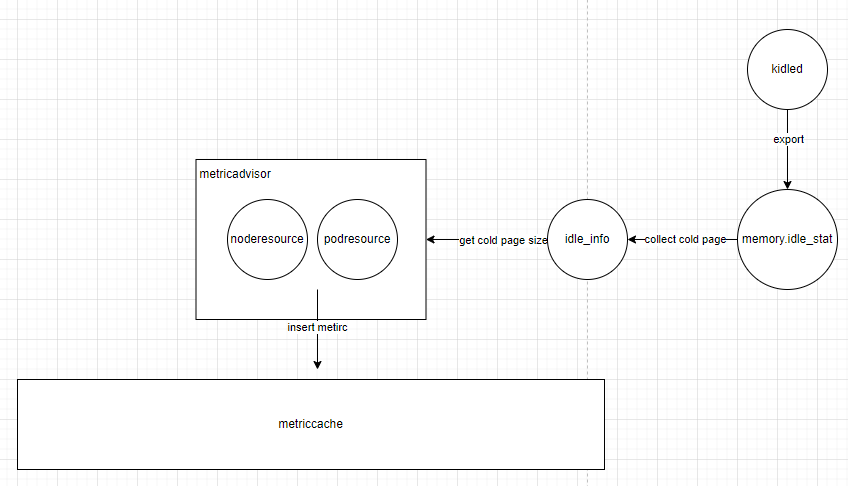
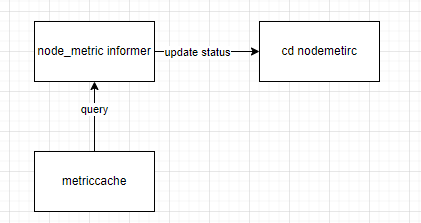

## Table of Contents

[TOC]

## Glossary

**cold page**

A cold page is a page that keeps idle for a long time in the page cache.

**hot page**

A cold page is a page that is often used in the page cache.

**kidled**

Kilded, an open source cold memory collection solution, identifies the hot and cold conditions of nodes, pod and container memory in the cluster. 

## Summary

To support more fine-grained memory overselling, incorporate cold memory compute into memory usage in koordinator.

## Motivation

Currently, the memory usage of nodes and pods collected by koordlet does not contain page cache. It is too aggressive. There are many hot pages that should be counted as memory usage in page cache .That will also help identify cold page and more fine-grained oversell memory. This proposal focuses on cold memory collection and report. 

### Goals

- Define a new util struct named idleinfo  to collect idle memory info.
- Informer report memory usage of including hot page and crd nodemetric will update status.
- Collect cold and hot condition  in node, pod and contain and insert metric in metriccache.

### Non-Goals/Future Work

- Cold memory supports  scheduling optimization in koord-manager or koord-scheduler.

## Proposal

### Design

#### collect cold memory info



#### report memory usage including hot page




#### add code

- Add a filed in NodeResourceMetric, PodResourceMetric and ContainerResourceMetric named ColdPage to represent cold page size.
- pkg/koordlet/metriccache/api.go

```go
type NodeResourceMetric struct {
	CPUUsed    CPUMetric
	MemoryUsed MemoryMetric
	GPUs       []GPUMetric
    //add
    ColdPageSize
}
```

- Add a filed named in spec named memorycollectpolicy to start cold page compute in cluster.

apis/slo/v1alpha1/nodemetric_types

```go
type NodeMetricCollectPolicy struct {
	// AggregateDurationSeconds represents the aggregation period in seconds
	AggregateDurationSeconds *int64 `json:"aggregateDurationSeconds,omitempty"`
	// ReportIntervalSeconds represents the report period in seconds
	ReportIntervalSeconds *int64 `json:"reportIntervalSeconds,omitempty"`
	// NodeAggregatePolicy represents the target grain of node aggregated usage
	NodeAggregatePolicy *AggregatePolicy `json:"nodeAggregatePolicy,omitempty"`
    //add
    MemoryCollectPolicy 
}
```

- Add a filed named in koordlet named feature-gate to start cold page compute in node.

pkg/koordlet/koordlet.go

```go
type daemon struct {
	metricAdvisor  metricsadvisor.MetricAdvisor
	statesInformer statesinformer.StatesInformer
	metricCache    metriccache.MetricCache
	resManager     resmanager.ResManager
	qosManager     qosmanager.QoSManager
	runtimeHook    runtimehooks.RuntimeHook
    //add wether to support cold collection
    feature-gate   bool
}
```

* Add idleinfo.go file in pkg/koordlet/util/idleinfo.go
* mend states_nodemetric.go to support cold memory compute
