## Table of Contents


- [Title](#title)
  - [Table of Contents](#table-of-contents)
  - [Glossary](#glossary)
  - [Motivation](#motivation)
    - [Goals](#goals)
    - [Non-Goals/Future Work](#non-goalsfuture-work)
  - [Proposal](#proposal)
    - [Design](#design)
    - [Collect idle memory info and insert memory with hot page](#collect-idle-memory-info-and-insert-memory-with-hot-page)
	- [Report memory usage including hot page](#report-memory-usage-including-hot-page)
	- [Define cold memory API](#define-cold-memory-api)
  - [Alternatives](#alternatives)
  - [Evaluation and Observability](#evaluation-and-observability)

## Glossary

**kidled**

Kidled, an open-source cold memory collection solution, identifies the hot and cold conditions of nodes, pod and container memory in the cluster. The link introduces kidled in detail.

https://github.com/alibaba/cloud-kernel/blob/linux-next/Documentation/vm/kidled.rst

**cold page**

The part of memory that is allocated to the application but probably unused for a while is called the "cold" memory. And the part of that in page cache is called cold page.

**hot page**

Relatively, the memory which may be reclaimable but would be reallocated shortly after is the "hot" memory. And the part of that in page cache is called hot page. 

## Summary

Implement the cold page info collecting and reporting. Based on that, we can incorporate cold memory computing into memory usage to support more fine-grained memory overcommitment in koordinator.

## Motivation

In general colocation scenarios, the resources that the high-priority (HP) applications have requested but not used are reclaimable to the low-priority (LP) applications to allocate. Resource reclaiming helps enhance the utilization of machines while increasing the risks of contentions. For memory resources, there are proportions of memory that are reusable on different levels. The free memory is allocatable to any process, while the page cache is potentially reusable after it is reclaimed by the system and no longer yields again. But for the better performance of the system, the kernel does not keep page cache idle and allocate the page cache to the application as possible. To construct a more reliable and fine-grained memory overcommitment, the free and cold memory of the HP is preferred to reclaim to LP first. And if not required, the hot memory of HP should not be overcommitted, or the performance of HP can be affected. 

In the Koordinator, we want to improve memory overcommitment by building the cold page reclaim ability, which can report the quantity of cold memory on the nodes and help assure that resource reclaiming like batch-memory are sound and efficient for the colocated applications.

https://github.com/koordinator-sh/koordinator/issues/1178

### Goals

Define the API for the cold pages. Implement the cold page info collecting and reporting.

### Non-Goals/Future Work

Cold memory supports scheduling optimization in koord-manager or koord-scheduler.

## Proposal

### Design

#### Collect idle memory info and insert memory with hot page



Add a coldPageCollector in collectorPlugins. coldPageCollector read cgroup file memory.idle_stat which is exported by kidled(Anolis kernel), kstaled(Google kernel)  or DAMON(amazon) that depends on the kernel. And memory.idle_stat includes cold page info in page cache and exists at each hierarchy of cgroup memory. After collecting cold page info, coldPageCollector will insert metric(such as NodeMemoryWithHotPageUsageMetric, PodMemoryWithHotPageUsageMetric, ContainerMemoryWithHotPageUsageMetric, NodeMemoryColdPageSizeMetric, PodMemoryColdPageSizeMetric, ContainerMemoryColdPageSizeMetric) into metriccache. 

MemFree: free and unallocated memory
NodeMemWithColdPage: cold page size in page cache of node

node-memory-usage: nodeMemWithHotPageUasge=MemTotal-MemFree-NodeMemWithColdPage

pod-memory-usage: podMemWithHotPageUasge=PodInactiveAnon + PodActiveAnon + PodUnevictable+PodMeMwithHotPageSize

container-memory-usage: containerMemWithHotPageUasge=ContainerInactiveAnon + ContainerActiveAnon + ContainerUnevictable+ContainerMemWithHotPageSize

The proposal implements kidled cold page collector and provides other cold page collector interfaces.

```go
//add collector
collectorPlugins = map[string]framework.CollectorFactory{
    noderesource.CollectorName:    noderesource.New,
    beresource.CollectorName:      beresource.New,
    nodecpuinfo.CollectorName:     nodecpuinfo.New,
    nodestorageinfo.CollectorName: nodestorageinfo.New,
    podresource.CollectorName:     podresource.New,
    podthrottled.CollectorName:    podthrottled.New,
    performance.CollectorName:     performance.New,
    coldmemoryresource.CollectorName: coldmemoryresource.New,
}

//define metric types
const {
    NodeMemoryWithHotPageUsage      MetricKind = "node_memory_with_hot_page_uasge"
    PodMemoryWithHotPageUsage       MetricKind = "pod_memory_with_hot_page_uasge"
    ContainerMemoryWithHotPageUsage MetricKind = "container_memory_with_hot_page_uasge"
    NodeMemoryColdPageSize          MetricKind = "node_memory_cold_page_size"
    PodMemoryColdPageSize           MetricKind = "pod_memory_cold_page_size"
    ContainerMemoryColdPageSize     MetricKind = "container_memory_cold_page_size"
}

//add metric
var {
    NodeMemoryWithHotPageUsageMetric      = defaultMetricFactory.New(NodeMemoryWithHotPageUsage)
    PodMemoryWithHotPageUsageMetric       = defaultMetricFactory.New(PodMemoryWithHotPageUsage)
    ContainerMemoryWithHotPageUsageMetric = defaultMetricFactory.New(ContainerMemoryWithHotPageUsage)
    NodeMemoryColdPageSizeMetric          = defaultMetricFactory.New(NodeMemoryColdPageSize)
    PodMemoryColdPageSizeMetric           = defaultMetricFactory.New(PodMemoryColdPageSize)
    ContainerMemoryColdPageSizeMetric     = defaultMetricFactory.New(ContainerMemoryColdPageSize)
}

//the concrete cold page collector depending on kernel
type kidledcoldPageCollector struct {
	collectInterval       time.Duration
	started               *atomic.Bool
	supported             *atomic.Bool
	cgroupReader          resourceexecutor.CgroupReader
	statesInformer        statesinformer.StatesInformer
	appendableDB          metriccache.Appendable
	metricDB              metriccache.MetricCache
	coldPageCollectorName string
}

//return different ColdPageCollector or nil (e.g.not support cold page) depending on kernel
func New(opt *framework.Options) framework.Collector {
	if opt.Config.ColdPageCollectorName == "kidled" {
		return &kidledcoldPageCollector{
			collectInterval:       opt.Config.CollectResUsedInterval,
			started:               atomic.NewBool(false),
			supported:             atomic.NewBool(false),
			statesInformer:        opt.StatesInformer,
			cgroupReader:          opt.CgroupReader,
			appendableDB:          opt.MetricCache,
			metricDB:              opt.MetricCache,
			coldPageCollectorName: opt.Config.ColdPageCollectorName,
		}
	}
	return nil
}

func (k *kidledcoldPageCollector) Enabled() bool
func (k *kidledcoldPageCollector) Setup(c1 *framework.Context)
func (k *kidledcoldPageCollector) Run(stopCh <-chan struct{})
func (k *kidledcoldPageCollector) Started() bool
func (k *kidledcoldPageCollector) collectColdPageInfo()
```

Implement kidled cold page collector. The proposal add a file idleinfo_exported_by_kided.go in pkg/koordlet/util/idleinfo_exported_by_kided.go

Define an idleinfo struct as follows. It corresponds to this memory.idle_stat file information. For example, c means clean. d means dirty. s means swap. f means file. e means evict. u means unevict. i means inactive. a means active. ``csea`` means the pages are clean && swappable && evictable && active. More details are at https://github.com/alibaba/cloud-kernel/blob/linux-next/Documentation/vm/kidled.rst.

```go
type KidledIdleInfo struct {
	Version             string   `json:"version"`
	PageScans           uint64   `json:"page_scans"`
	SlabScans           uint64   `json:"slab_scans"`
	ScanPeriodInSeconds uint64   `json:"scan_period_in_seconds"`
	UseHierarchy        uint64   `json:"use_hierarchy"`
	Buckets             []uint64 `json:"buckets"`
	Csei                []uint64 `json:"csei"`
	Dsei                []uint64 `json:"dsei"`
	Cfei                []uint64 `json:"cfei"`
	Dfei                []uint64 `json:"dfei"`
	Csui                []uint64 `json:"csui"`
	Dsui                []uint64 `json:"dsui"`
	Cfui                []uint64 `json:"cfui"`
	Dfui                []uint64 `json:"dfui"`
	Csea                []uint64 `json:"csea"`
	Dsea                []uint64 `json:"dsea"`
	Cfea                []uint64 `json:"cfea"`
	Dfea                []uint64 `json:"dfea"`
	Csua                []uint64 `json:"csua"`
	Dsua                []uint64 `json:"dsua"`
	Cfua                []uint64 `json:"cfua"`
	Dfua                []uint64 `json:"dfua"`
	Slab                []uint64 `json:"slab"`
}
```

Define a function named readidleInfo() in koordlet util module. It can read idleinfo memory.idle_stat which exists under every hierarchy of cgroup memory. (node e.g. /sys/fs/cgroup/memory/memory.idle_stat)

```go
func ReadIdleInfo(path string) (*IdleInfo, error) 
```

Define a function named GetIdleInfoFilePath(). It is used to return idleinfo file path. (node e.g. /sys/fs/cgroup/memory/memory.idle_stat)

```go
func GetIdleInfoFilePath(idleFileRelativePath string) string 
```

#### Report memory usage including hot page


collectNodeMetric() is used to query node metric and return CPU And MemUsed in pkg/koordlet/statesinformer/impl/states_nodemetirc.go file.

We can report memory usage including hot pages in collectNodeMetric().

The calculation formulas of node, pod and container are as follows. 

MemFree: free and unallocated memory
NodeMemWithColdPage: cold page size in page cache of node

node-memory-usage: nodeMemWithHotPageUasge=MemTotal-MemFree-NodeMemWithColdPage

pod-memory-usage: podMemWithHotPageUasge=PodInactiveAnon + PodActiveAnon + PodUnevictable+PodMeMwithHotPageSize

container-memory-usage: containerMemWithHotPageUasge=ContainerInactiveAnon + ContainerActiveAnon + ContainerUnevictable+ContainerMemWithHotPageSize

The same process is executed pod informer to report memory usage. Do not repeat.

#### Define cold memory API

Provide memory-collect policy access.

Add a field named MemoryCollectPolicy to represent which method is used to collect memory usage. Such as usageWithHotPageCache, usageWithoutPageCache,  usageWithPageCache.

You can create a crd nodemetric resource and specify the value of Spec.CollectPolicy.MemoryCollectPolicy to start collecting cold memory compute. 

```go
// NodeMetricCollectPolicy defines the Metric collection policy
type NodeMetricCollectPolicy struct {
	// AggregateDurationSeconds represents the aggregation period in seconds
	AggregateDurationSeconds *int64 `json:"aggregateDurationSeconds,omitempty"`
	// ReportIntervalSeconds represents the report period in seconds
	ReportIntervalSeconds *int64 `json:"reportIntervalSeconds,omitempty"`
	// NodeAggregatePolicy represents the target grain of node aggregated usage
	NodeAggregatePolicy *AggregatePolicy `json:"nodeAggregatePolicy,omitempty"`
	//MemoryWithHotPageCollectPolicy represents whether collet memory usage with hot page instead of memory usage without page cache
	MemoryCollectPolicy string `json:"memoryCollectPolicy,omitempty"`
}
```
## Alternatives

**kidled**: kidled, an open-source cold memory collection solution, is used by Anolis OS.

https://github.com/alibaba/cloud-kernel/blob/linux-next/Documentation/vm/kidled.rst

**kstaled**: kstaled is used by google linux kernel. It was designed by Michel. Michel's patch was developed on an early kernel version 3.0 and was similar to kidled. kstable also use /sys/kernel/mm/kstaled/scan_seconds and export idle_page_stats file. But kidled did not cherry pick the original kstaled's patch directly and made improvements. (e.g. design use_hierarchy )

https://lwn.net/Articles/459269/

https://lore.kernel.org/lkml/20110922161448.91a2e2b2.akpm@google.com/T/

**DAMON**: DAMON was used by the Amazon Linux kernel.

https://lwn.net/Articles/858682/

Why do we choose kidled? The reasons are as below.

1) Anolis OS  is open-sourced and has already supported kidled. We can directly use the API and it is very simple.
2) Kidled has a global scanner to do this job. That avoids a lot of unnecessary jobs. For example switch between user and kernel mode and handle share mappings.
## Evaluation and Observability
In this part, some metrics are evaluated for performance after cold memory collection is turned on.

After cold memory collection, memory usage includes hot page.

Page refault: Page refault is a direct metric. Page fault on evited pages will occur when the page is not in memory. For example, cold pages will be few and page refault will appear frequently when the overhead rises.

Page hit ratio: Page recycling frequency is a supplementary metric for page refault. When page refault always appears, page hit ratio declines.

Page cache recycling frequency: Page cache recycling will be triggered when the overhead rises and causes insufficient Memory. And at the time, cold page is rare.
