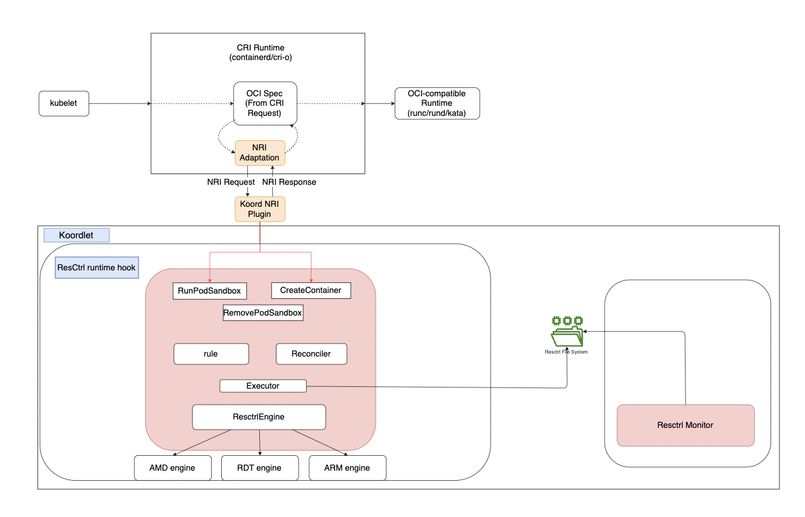

# Resctrl QoS Enhancement

## Table of Contents
=================

* [Resctrl QoS Enhancement](#resctrl-qos-enhancement)
    * [Table of Contents](#table-of-contents)
    * [Glossary](#glossary)
    * [Summary](#summary)
    * [Motivation](#motivation)
        * [Goals](#goals)
        * [Non-Goals/Future Work](#non-goalsfuture-work)
    * [Proposal](#proposal)
        * [User Stories](#user-stories)
            * [Story 1](#story-1)
            * [Story 2](#story-2)
            * [Story 3](#story-3)
            * [Story 4](#story-4)
        * [Requirements (Optional)](#requirements-optional)
            * [Functional Requirements](#functional-requirements)
                * [FR1](#fr1)
                * [FR2](#fr2)
            * [Non-Functional Requirements](#non-functional-requirements)
                * [NFR1](#nfr1)
                * [NFR2](#nfr2)
        * [API](#api)
        * [Implementation Details/Notes/Constraints](#implementation-detailsnotesconstraints)
            * [Resctrl Runtime Hook Plugin](#resctrl-runtime-hook-plugin)
                * [Resctrl Runtime Hook Plugin Init](#resctrl-runtime-hook-plugin-init)
                * [Pod Level LLC/MBA](#pod-level-llcmba)
                * [Fixed Class Level LLC/MBA](#fixed-class-level-llcmba)
                * [Exsiting Pod](#exsiting-pod)
            * [Resctrl Metrics Collector](#resctrl-metrics-collector)
        * [Evaluation and Observability](#evaluation-and-observability)
        * [Risks and Mitigations](#risks-and-mitigations)
    * [Alternatives](#alternatives)
    * [Upgrade Strategy](#upgrade-strategy)
    * [Additional Details](#additional-details)
        * [Test Plan [optional]](#test-plan-optional)
    * [Implementation History](#implementation-history)

## Glossary

Resource Control (resctrl) is a kernel interface for CPU resource allocation The resctrl interface is available in kernels 4.10 and newer. Currently, Resource Control supports L2 CAT, L3 CAT and L3 CDP which allows partitioning L2 and L3 cache on a per core/task basis. It also supports MBA, the maximum bandwidth can be specified in percentage or in megabytes per second (with an optional mba_MBps flag).

This feature has different names depending on the processor: Intel Resource Director Technology (Intel(R) RDT) for Intel and AMD Platform Quality of Service (AMD QoS) for AMD.

Intel® Resource Director Technology (Intel® RDT) brings new levels of visibility and control over how shared resources such as last-level cache (LLC) and MBA allocation(MBA) are used by applications, virtual machines (VMs), and containers. See: https://www.intel.com/content/www/us/en/architecture-and-technology/resource-director-technology.html

AMD QoS are intended to provide for the monitoring of the usage of certain system resources by one or more processors and for the separate allocation and enforcement of limits on the use of certain system resources by one or more processors. The initial QoS functionality is for L3 cache allocation enforcement, L3 cache occupancy monitoring, L3 code-data prioritization, and MBA enforcement/allocation. See: https://www.amd.com/content/dam/amd/en/documents/processor-tech-docs/other/56375_1_03_PUB.pdf

Memory System Resource Partitioning and Monitoring (MPAM) is an optional addition to the ARM architecture to support memory system partitioning. MPAM extends the ability for software to co-manage runtime resource allocation of memory system components such as caches, interconnects, and memory controllers. See: https://developer.arm.com/documentation/107768/0100/Overview?lang=en

## Summary

We're aiming to optimize LLC and MBA utilization within Koordinator by:
- Harnessing NRI to seamlessly bind pods to resctrl control groups, enabling granular resource allocation
- Integrating real-time LLC and MBA monitoring capabilities, providing accurate insights into resource usage patterns
- Implementing pod-level, real-time control over LLC and MBA, empowering dynamic adjustments to meet application demands

## Motivation

Currently, Koordinator supports LLC and MBA configuration and adjustment by config map based on class level. It uses a goroutine to set/adjust RDT configuration in async mode which may not in real time. We can also refer this [issue](!https://github.com/koordinator-sh/koordinator/issues/756) in github. As Koordinator already supports NRI in 1.3.0 release, we can migrate current function into Koordlet runtimehooks as an runtime hook plugin which could be more real time. Furthermore, we propose bolstering resctrl capabilities by integrating real-time monitoring and pod-level LLC/MBA configuration/adjustment. This richer data landscape will empower Koordinator to make informed decisions regarding the dynamic allocation of LLC, MBA, and potentially even other resources, tailoring them to the specific needs of diverse workloads.

### Goals

- Migrate existing fixed class LLC and MBA configuration to NRI-powered runtime hooks for timely execution
- Add LLC and MBA monitor for fixed class
- Add pod level LLC and MBA configuration/adjustment and monitor

### Non-Goals/Future Work

- Resctrl policy to better use LLC and MBA resource
- QoS manager plugin to detect noisy neighbor based on CPU, Memory, LLC, MBA and potential other resources to adjust LLC and MBA
- Scheduler based on LLC and MBA resource

## Proposal

To achieve real-time control over LLC and MBA at fixed class and pod level, we will implement a runtime hook plugin dedicated to these functionalities. This plugin, named the Resctrl runtime hook plugin, will leverage NRI to facilitate timely adjustments and granular resource management.

- Resctrl runtime hook will create/update QoS class level by using Rule to subscribe NodeSLO
- Resctrl runtime hook subscribe RunPodSandBox event, and will handle pod level LLC and MBA schemata init
- Resctrl runtime hook subscribe CreateContainer event, and set closid to ContainerContext, ContainerContext will update OCI spec based on the closid
- Resctrl runtime hook will register a callback to Reconciler to consume ContainerTaskIds and then update new ContainerTaskIds to corresponding resctrl control group and monitor group

Concurrently with the implementation of the Resctrl runtime hook plugin, we will deploy a dedicated Resctrl metric collector. This collector leverages NodeSLO and PodsInformer to gather real-time data on fixed class and pod-level LLC and MBA. This architecture, as depicted in the below diagram, ensures comprehensive resource consumption insights, which are crucial for informing the dynamic adjustments.



### User Stories

#### Story 1
As a cluster administrator, I want to apply and adjust LLC/MBA QoS class configuration during runtime to get better resource usage
#### Story 2
As a user, I want to adjust my workload's LLC/MBA resource during runtime.
#### Story 3
As a cluster administrator, I want to monitor cluster LLC/MBA resource usage.
#### Story 4
As a cluster administrator, I find some workloads are noisy neighbor, I want to limit these noisy neighbors' LLC/MBA.

### Requirements (Optional)
Need Koordinator to upgrade to 1.5.0+

#### Functional Requirements

Resctrl runtime hook plugin should support all existing functionalities by current Resctrl QoS plugin

##### FR1

##### FR2

#### Non-Functional Requirements

Non-functional requirements are user expectations of the solution. Include
considerations for performance, reliability and security.

##### NFR1

##### NFR2

### API
To support pod level LLC/MBA limit, we add a new annotation, the annotation key is `node.koordinator.sh/resctrl`.

Below is the example value of the annotation. schemata defines all caches' configuration. schemataPerCache will define specific cache's configuration which will not use all caches' configuration. 
```go
{
  "LLC": {
    "schemata": {
      "range": [20,80],
    },
    "schemataPerCache": [
      {
        "cacheid" : 0,
        "range": [20,50]
      },
      {
        "cacheid" : 1,
        "range": [20,60]
      },
    ],
  },
  "MB": {
    "schemata": {
      "percent": 20,
    },
    "schemataPerCache": [
      {
        "cacheid": 0,
        "percent": 20
      },
      {
        "cacheid": 1,
        "percent": 40
      },
    ],
  }
}
```

schemata and schemataPerCache are defined as below structures:

```go 
type SchemataConfig struct {
    Percent int `json:"percent,omitempty"`
    Range []int `json:"percent,omitempty"`
}

type SchematePerCacheConfig struct {
    CacheID         int `json:"cacheID,omitempty"`
    SchemataConfig  `json:",inline"`
}
```

The annotation value finally will be parsed as below which define LLC and MB configuration:
```go
type Resctrl struct {
    LLC map[int]int64
    MB map[int]int64
}
```

### Implementation Details/Notes/Constraints

To achieve fine-grained control and monitoring of LLC and MBA resources, we propose the implementation of a two-pronged approach:
1. Resctrl Runtime Hook Plugin
2. Resctrl Metrics Collector

**Proposed Implementation Steps**
1. Add pod level resctrl support: extend the runtime hook plugin
2. Migration of Existing QoS class level LLC/MBA function: Relocate current QoS class level Resctrl functions to the runtime hook plugin for more immediate execution.
3. Implementation of QoS class level LLC/MBA metrics collector: Introduce a dedicated monitor within the metrics collector to track resource usage at the QoS class level.
4. Add pod level LLC/MBA metric collector

#### Resctrl Runtime Hook Plugin
##### Resctrl Runtime Hook Plugin Init
1. When plugin init, register rule to create QoS ctrl group based on NodeSLO config, and it will automatically create a monitor group. Also it will leverage reconciler to delete unused Resctrl group which are created by Resctrl runtime hook.
2. For group level LLC and MBA config, use rule update LLC and MBA config

##### Pod Level LLC/MBA
1. Subscribe RunPodSanbox, when pod with the annotation `node.koordinator.sh/resctrl`，ResctrlEngine will parse LLC and MBA configuration based on the annotation and put the result to PodContext.
2. Pod Context will create an extra ctrl group and monitor group for the pod
3. Subscribe CreateContainer, resctrl runtime hook will get closid and runc prestart hook from ResctrlEngine and update ContainerContext, ContainerContext will update OCI spec
4. Subscribe RemovePodSandBox, resctrl runtime hook will leverage PodContext to remove corresponding control group and monitor group


##### Fixed Class Level LLC/MBA
1. Subscribe RunPodSanbox, if pod without annotation `node.koordinator.sh/resctrl`, ResctrlEngine will record this pod.
2. Subscribe CreateContainer, resctrl runtime hook will get closid and runc prestart hook from ResctrlEngine, and then update ContainerContext, leverage ContainerContext to adjust OCI spec

##### Exsiting Pod
We leverage reconciler to reconcile exiting pods and to ensure eventual consistency of pod's LLC/MBA.

**Resctrl Engine**

Resctrl Engine will provide unify interface for different platform. Different platform may have different schemata and different policy for the same configuration. 

For Different platform, we will implement different ResctrlEngine like RDTEngine for intel, AMDEngine for AMD, ARMEngine for ARM.
RDTEngine will implement ResCtrlEngine interface. Currently, RDTEngine is very simple and only focus on parse pod RDT resource request and resctrl runtime hook will update ContainerContext based on these info. In the future, we will have policy in engine for dynamically adjust resctrl resources.


```go
type App struct {
    ResCtrl ResCtrl
    Hook Hook
    Closid string
}

type ResctrlEngine interface {
    Rebuild() // rebuild the current control group
    GetCurrentCtrlGroups() map[string]Resctrl
    Config(config map[string]ResctrlQOSCfg) 
    GetConfig() map[string]ResCtrl
    RegisterApp(podid, annotation, closid) error
    GetApp(podid) (App, error)
}

type RDTEngine struct {
    Apps map[string]App
    CtrlGroups map[string]Resctrl
}
```

**Resctrl Runtime Hook**

```go
type plugin struct {
    engine   ResctrlEngine
    rule     *Rule
    executor resourceexecutor.ResourceUpdateExecutor
}

func (p *plugin) Register(op hooks.Options) {
    hooks.Register(rmconfig.PreRunPodSandbox, name, description+" (pod)", p.SetPodResCtrlResources)
    hooks.Register(rmconfig.CreateContainer, name, description+" (pod)", p.SetContainerResCtrlResources)
    hooks.Register(rmconfig.RemoveRunPodSandbox, name, description+" (pod)", p.RemovePodResCtrlResources)
    rule.Register(ruleNameForNodeSLO, description,
        rule.WithParseFunc(statesinformer.RegisterTypeNodeSLOSpec, p.parseRuleForNodeSLO),
        rule.WithUpdateCallback(p.ruleUpdateCbForNodeSLO))
    reconciler.RegisterCgroupReconciler(reconciler.PodLevel, sysutil.Resctrl, description+" (pod resctl schema)", p.SetPodResCtrlResources, reconciler.PodQOSFilter(), podQOSConditions...)
    reconciler.RegisterCgroupReconciler(reconciler.ContainerTasks, sysutil.Resctrl, description+" (pod resctl taskids)", p.UpdatePodTaskIds, reconciler.PodQOSFilter(), podQOSConditions...)

    if RDT {
        p.engine = NewRDTEngine()
    }
    else if AMD {
        p.engine = AMDEngine{}
    } else {
        p.engine = ARMEngine{}
    }
    p.engine.Rebuild()
}

// parseRuleForNodeSLO will parse Resctrl rule from NodeSLO
func (p *plugin) parseRuleForNodeSLO() {

}

// ruleUpdateCbForNodeSLO will update RDT QoS class schemata in resctrl filesystem
func (p *plugin) ruleUpdateCbForNodeSLO() {
    // Get config from NodeSLO
    p.engine.Config(configString)
    config := p.engine.GetConfig()
    for class := range (classes) {
        schemata := config[class]
        e := audit.V(3).Group("RDT").Reason(name).Message("set %s to %v", class, schemata)
        updater, err := resourceexecutor.DefaultCgroupUpdaterFactory.New(sysutil.Resctrl, cgroupPath, schemata, e)
        p.executor.Update(cgroup, schemata)...
    }
}

// GetClosId get closid from annotation
func GetClosId(annotation string, label string) string {
    if _, ok := annotation["nodes.koordinator.sh/resctrl"]; ok {
        return podid
    } else {
        return QoSClass
    }
}

// SetPodResctrl will set control group and monitor group info based on annotation to PodContext
func (p *plugin) SetPodResCtrlResources(proto protocol.HooksProtocol) error {
    closid := GetClosId(annotation, label)
    p.engine.RegisterApp(podid, annotation, closid)
    resctrl, err := p.engine.GetApp(p.engine, annotation).Resctrl
    updatePodContext(podid, resctrl)
}

// RemovePodResCtrlResources will set Resctrl remove msg to PodContext
func (p *plugin) RemovePodResCtrlResources(proto protocol.HooksProtocol) error {
    if _, ok := annotation["nodes.koordinator.sh/resctrl"]; !ok {
        return nil
    }
    closid := GetClosId(annotation, label)
    p.engine.UnRegisterApp(podid)
    updatePodContext(podid, closid)
}

// SetContainerResCtrlResources will get Resctrl meta data and update ContainerContext
func (p *plugin) SetContainerResCtrlResources(proto protocol.HooksProtocol) error {
    // closid, BE, LS, podid
    closid := GetClosId(annotation, label)
    app, err := p.engine.GetApp(podid)
    updateContainerContext(podid, containerid, app.closid, app.Hooks)
}

// UpdatePodTaskIds will update new taskids to resctrl file system
func (p *plugin) UpdatePodTaskIds(proto protocol.HooksProtocol) error {
    // 1. retrieve task ids for each slo and each specific LLC/MBA request pod by consume pod taskids
    // 2. add the new related task ids in resctrl groups
}
```

**PodContext**
```go

func (p *PodContext) NriDone(executor resourceexecutor.ResourceUpdateExecutor) {
    if p.executor == nil {
        p.executor = executor
    }
    p.injectForExt()
    p.Update()
}

func (p *PodContext) NRIRemoveDone() {
    if p.executor == nil {
        p.executor = executor
    }
    p.removeForExt()
    p.Update()
}

// removeForExt will handle NRI remove/clean operation
func (p *PodContext) removeForExt() {
    
}
func injectResctrl(closid string, schemata string, a *audit.EventHelper, e resourceexecutor.ResourceUpdateExecutor) (resourceexecutor.ResourceUpdater, error) {
    // for specific pods, create control group and monitor group and update schemata
}

func removeResctrl(closid string, a *audit.EventHelper, e resourceexecutor.ResourceUpdateExecutor) (resourceexecutor.ResourceUpdater, error) {
    // for specific pods, create control group and monitor group and update schemata
}
```

**ContainerContext**
```go
func (c *ContainerContext) NriDone(executor resourceexecutor.ResourceUpdateExecutor) (*api.ContainerAdjustment, *api.ContainerUpdate, error) {
    ......
    if c.Response.Resources.Resctrl != nil {
        // adjust OCI spec
        adjust.SetLinuxRDTClass(c.Response.Resources.Resctrl.Closid)
        adjust.Hooks = c.Response.Resources.Resctrl.Hooks
    }
}
```

**Resources**

```go
type Resctrl struct {
    Schemata string
    Hooks string
    Closid string
}

type Resources struct {
    // origin resources
    CPUShares   *int64
    CFSQuota    *int64
    CPUSet      *string
    MemoryLimit *int64

    // extended resources
    CPUBvt *int64
    Resctrl *Resctrl
}
```

**ResctrlUpdater**

We will enhance current ResctrlUpdate to support directly overwrite schemata. Current ResctrlUpdater doesn't support override schemata with LLC and MBA together directly and doesn't consider NUMA when apply schemata .

```go
func NewResctrlSchemata(group, schemata string) ResourceUpdater {

}

func NewResctrlSchemataWithNuma(group, resctrl Resctrl) ResourceUpdater {

}

```

**podsInformer**

podsInformer will add a new interface to get all pods' taskids, Resctl runtime hook Reconciler will register callback to consume these information and write new taskIds to resctrl contrl group and monitor group.

```go

type PodMeta struct {
    Pod       *corev1.Pod
    CgroupDir string
    // Add new field, todo: memory usage
    ContainerTaskIds map[string][]uint64
}

func readPodTaskIds(cgroup string) []uint64 {

}

func (s *podsInformer) syncPods() error {
    ...
    for _, pod := range podList.Items {
        podMeta := &statesinformer.PodMeta{
            Pod:       pod.DeepCopy(),
            CgroupDir: genPodCgroupParentDir(&pod), 
            ContainerTaskIds: make([]uint64)
        }
        newPodMap[string(pod.UID)] = podMeta
        // Add ContainerTaskIds to podMeta
        // record pod container metrics
        recordPodResourceMetrics(podMeta)
    }
    ...
}
```

**Reconciler**

Reconciler will help guarantee eventual consistency of Resctrl configuration. It will reconcile all QoS class resctrl config based on NodeSLO. For pod level, it will reconcile all pods resctrl config based on their annotations. 


```go
func (c *reconciler) reconcilePodCgroup(stopCh <-chan struct{}) {
    // TODO refactor pod reconciler, inotify watch corresponding cgroup file and update only when receive modified event
    // new watcher will be added with new pod created, and deleted with pod destroyed
    for {
        select {
            // add new pod event handler
            case <-c.PodAdded:
                // add resctrl group for specific pod
            case <-c.podUpdated:
                podsMeta := c.getPodsMeta()
                // call Resctrl runtime hook reconcilerFn to write new taskids to cgroup
            // add new pod event handler
            case <-c.PodRemoved:
                // remove resctrl group for specific pod
        ......
        }
        }
    }
}
```

#### Resctrl Metrics Collector

Currently, we only retrieve QoS class level resctrl data like LLC and MBA. For further pod level monitor data, we will iterate all pods and get pod level metric.
1. collector check whether resctrl file system supported and mounted
2. iterate all QoS class monitor group in resctrl file system and read data from it and save data to DB
4. iterate all Pods monitor group in resctrl file system and read data from it and save data to DB
```go
func (p *ResourceCtrlCollector) collectQoSClassResctrlResUsed() {
    // NodeSLO, get all class level Resctrl usage
    for class := range classes {
        resctrl, err := GetResctrlUsage(classCgroupPath)
    }
}

func (p *ResourceCtrlCollector) collectQoSClassResctrlResUsed() {
    // Pods, get all specific pod Resctrl usage
    for pod := range pods {
        resctrl, err := GetResctrlUsage(podCgroupPath)
    }
}
```

### Evaluation and Observability
In this part, some metrics are evaluated for performance after Resctrl Hook Plugin is enabled.

### Risks and Mitigations

- For existing pod, we still need reconciler to continually read/write cgroup file system which may cause performance issue
- Rely on NRI which Koordinator support from v1.3.0
## Alternatives

Resctrl QoSManager Plugin is an asynchronize plugin which may not reconcile LLC/MBA resource in real time and need to iterate all task ids in pod/container periodically.

## Upgrade Strategy

## Additional Details

### Test Plan [optional]

## Implementation History
- [ ] 10/28/2022: Proposed idea in an issue 
- [ ] 12/28/2023: Open proposal PR


