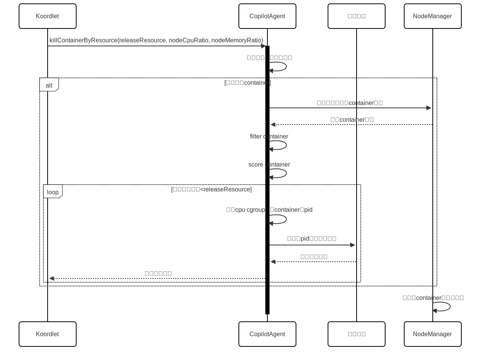

# Support evict yarn container
## Motivation
Currently, Koordinator's eviction functionality for YARN containers is incomplete, only supporting eviction at the NodeManager pod granularity. 
This affects all containers running under the NodeManager. To address this, a container-level eviction switch has been added for memory and CPU eviction. 
When the switch is enabled, Koordlet will send container eviction requests to the yarn-copilot-agent, thereby reducing the scope of impact.
### Goals
1. Support evict yarn container
## Proposal

### User Stories

#### Story 1

As a user, when koordlet config evict-by-copilot-agent=true ,I can evict containers of yarn nodemanager,not evicting entire pod

### Design

1.When memory eviction or CPU eviction is triggered, if YARN container eviction is enabled, 
Koordlet will send the request to the YARN Copilot Agent for processing.
2.Upon receiving the request, the YARN Copilot Agent invokes the NodeManager’s interface to retrieve all containers in non-terminal states. 
These containers are then filtered and scored to identify candidates for eviction.
3.The filtering step excludes containers running the ApplicationMaster (AM). 
The scoring step ranks containers in reverse order, prioritizing the eviction of the most recently submitted non-AM containers to minimize the impact scope.