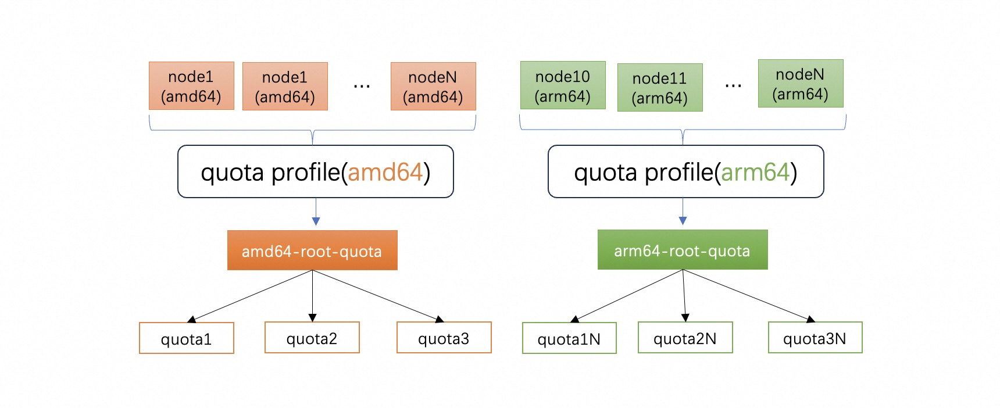

# Multi Tree Elastic Quota

## Table of Contents

- [Multi Tree Elastic Quota](#multi-tree-elastic-quota)
  - [Table of Contents](#table-of-contents)
  - [Summary](#summary)
  - [Motivation](#motivation)
      - [Goals](#goals)
      - [Non-Goals/Future Work](#non-goalsfuture-work)
  - [Proposal](#proposal)
    	- [User Stories](#user-stories)
      		- [Story 1](#story-1)
      		- [Story 2](#story-2)
    	- [Architecture](#architecture)
    	- [Implementation Details](#implementation-details)
    	  - [API](#api)
    	  - [Koord-manager](#koord-manager)
    	  - [Koord-scheduler](#koord-scheduler)
  - [Implementation History](#implementation-history)


## Summary


The proposal provides a mechanism to construct multiple trees for elastic quota. Different quota tree can include different nodes. It will help the cluster administrators to manage the node resource more granularly


## Motivation

[Elastic Quota](https://github.com/koordinator-sh/koordinator/blob/main/docs/proposals/scheduling/20220722-multi-hierarchy-elastic-quota-management.md) provides a balance between enforcing limits to prevent resource exhaustion and allowing for efficient use of resources. Currently, there is only a quota tree in cluster. The root quota is `koordinator-root-quota`, all other quotas is the descendants of the root quota. In addition, all nodes resources belong to the only quota tree. 

But the kubernetes products(ACK/EKS/GKE) from cloud providers usually provide users with the concept of node pools to support users in managing different workloads. It means than the users can create multiple node pools to deploy different workloads and the workloads can't spread cross node pools. But the elastic quota tree includes all nodes, it's not accurate. 

In this case, we should build a single quota tree for every node pool.

### Goals

- Define a API to construct multiple quota trees
- Enhance the elastic quota and help the cluster administrators to manage the node resource more granularly

### Non-Goals/Future Work

- Improve the cluster resource usage

## Proposal


### User Stories

#### Story 1

cluster administrator devides nodes based on the node cpu architecture. There are two node pools: amd64 node pools and arm64 node pools. The amd64 pools include amd64 nodes, annother pool include arm64 nodes. We construct two quota trees based the node pools.


The user creates child quota as the children of amd64 quota tree, and associate pods with it. The pods will be scheduled to the amd64 nodes.


The resource can be shared in a single quota tree, but not shared between different trees


#### Story 2
In certain AI scenarios, to reduce network latency, we forbid deploy jobs across availability zones. We should construct multi quota trees according to the availability zones. Every availability zone has a quota tree which include the same availability zone nodes.


### Architecture





### Implementation Details


#### API

##### ElasticQuotaProfile

A Custom Resource Definition (CRD) named `ElasticQuotaProfile` is proposed to describe a quota tree

```go
type ElasticQuotaProfile struct {
	metav1.TypeMeta   `json:",inline"`
	metav1.ObjectMeta `json:"metadata,omitempty"`

	Spec   ElasticQuotaProfileSpec   `json:"spec,omitempty"`
	Status ElasticQuotaProfileStatus `json:"status,omitempty"`
}

type ElasticQuotaProfileSpec struct {
	// QuotaName defines the associated quota name of the profile.
	// +required
	QuotaName string `json:"quotaName"`
	// QuotaLabels defines the labels of the quota.
	QuotaLabels map[string]string `json:"quotaLabels,omitempty"`
	// ResourceRatio is a ratio, we will use it to fix the resource fragmentation problem.
	// If the total resource is 100 and the resource ratio is 0.9, the allocable resource is 100*0.9=90
	ResourceRatio *string `json:"resourceRatio,omitempty"`
	// NodeSelector defines a node selector to select nodes.
	// +required
	NodeSelector *metav1.LabelSelector `json:"nodeSelector"`
}

type ElasticQuotaProfileStatus struct {
}
```


* `NodeSelector`: define a label selector to select particular nodes. The match nodes belong to the quota tree
* `QuotaName`: define the root quota name of the quota tree. The operator will create the root quota if not existed.
* `QuotaLabels`: define the labels which will be updated to root quota
* `ResourceRatio`: control the total resource reported. If the total resource is 100 and the resource ratio is 0.9, the allocable resource is 100*0.9=90


##### ElasticQuota 

We addon some annotations for elastic quota to construct multiple quota trees

* `quota.scheduling.koordinator.sh/tree-id`: every quota tree has a unique tree id. The elastic quotas in the same tree have the same tree id. Users don't need add the tree-id annotation when create elastic quota. Indeed the webhook will inject tree-id if the quota is the descendants of root quota.

* `quota.scheduling.koordinator.sh/is-root`: If the quota is the root of the quota tree, the controller will add the  annotation which means the quota is the root of quota tree


#### Koord-manager

##### elastic-quota-profile-controller

add a controller named elastic-quota-profile-controller. The controller watch the elastic-quota-profile. It will do some works: 

* create the root quota if the quota not existed and generate the tree id
* total resource summary: it will sum the resource of matched nodes periodically, and updated it to the root quota as an annotation `quota.scheduling.koordinator.sh/total-resource` 


example 

```yaml
apiVersion: quota.koordinator.sh/v1alpha1
kind: ElasticQuotaProfile
metadata:
  labels:
    kubernetes.io/arch: amd64
    topology.kubernetes.io/region: cn-hangzhou
    topology.kubernetes.io/zone: cn-hangzhou-k
  name: cn-hangzhou-k-amd64-standard
  namespace: kube-system
spec:
  nodeSelector:
    matchLabels:
      kubernetes.io/arch: amd64
      topology.kubernetes.io/region: cn-hangzhou
      topology.kubernetes.io/zone: cn-hangzhou-k
  quotaLabels:
    kubernetes.io/arch: amd64
    quota.scheduling.koordinator.sh/is-parent: "true"
    topology.kubernetes.io/region: cn-hangzhou
    topology.kubernetes.io/zone: cn-hangzhou-k
  quotaName: cn-hangzhou-k-amd64-root-quota
  resourceRatio: "0.9"
```

the controller will create the root quota of the quota tree

```yaml
apiVersion: scheduling.sigs.k8s.io/v1alpha1
kind: ElasticQuota
metadata:
  annotations:
    quota.scheduling.koordinator.sh/total-resource: '{"cpu":"276480m","ephemeral-storage":"5257857641983","memory":"1894530432614","pods":"360"}'
  labels:
    kubernetes.io/arch: amd64
    quota.scheduling.koordinator.sh/is-parent: "true"
    quota.scheduling.koordinator.sh/is-root: "true"
    quota.scheduling.koordinator.sh/parent: koordinator-root-quota
    quota.scheduling.koordinator.sh/profile: cn-hangzhou-k-amd64
    quota.scheduling.koordinator.sh/tree-id: "9066322268974913314"
    topology.kubernetes.io/region: cn-hangzhou
    topology.kubernetes.io/zone: cn-hangzhou-k
  name: cn-hangzhou-k-amd64-root-quota
  namespace: kube-system
spec:
  max:
    cpu: "4611686018427387"
    memory: "4611686018427387"
  min:
    cpu: 276480m
    memory: "1894530432614"
```

##### webhook

webhook will add some mutating works for pods and elastic quotas

* `pod node affinity`: as the elastic quota profile selects particular nodes, if the user associates pods with the quota in the tree, we should limit the pods to be scheduled to matched nodes. So the webhook will inject corresponding node affinity into the pods.

* `elastic quota tree id`: if the user create a elastic quota as the descendants of the quota tree, The webhook will inject corresponding tree id into the quota. In addition, the webhook will forbid change the quota tree id to reduce complexity.

#### Koord-scheduler

##### elastic quota plugin

The elastic quota plugin handles the elastic quotas. The `groupQuotaManager` will handle all elastic quotas and calculate runtimeQuota.


```go
type Plugin struct {
	handle            framework.Handle
	client            versioned.Interface
	pluginArgs        *config.ElasticQuotaArgs
	quotaLister       v1alpha1.ElasticQuotaLister
	quotaInformer     cache.SharedIndexInformer
	podLister         v1.PodLister
	pdbLister         policylisters.PodDisruptionBudgetLister
	nodeLister        v1.NodeLister
	groupQuotaManager *core.GroupQuotaManager
}
```

To implement multi quota trees. We will construct a `groupQuotaManager` for every quota tree.

add two fileds 

* `groupQuotaManagersForQuotaTree`: store multiple GroupQuotaManagers. The key is the tree id, value is corresponding groupQuotaManager
* `quotaToTreeMap`: store the mapping of quota and tree. The key is the quota name, value is the tree id


```go
type Plugin struct {
   ...
   
	quotaManagerLock sync.RWMutex
	// groupQuotaManagersForQuotaTree store the GroupQuotaManager of all quota trees. The key is the quota tree id
	groupQuotaManagersForQuotaTree map[string]*core.GroupQuotaManager

	quotaToTreeMapLock sync.RWMutex
	// quotaToTreeMap store the relationship of quota and quota tree
	// the key is the quota name, the value is the tree id
	quotaToTreeMap map[string]string
}
```

##### runtime quota calculate

Previously, all node resources are summed to calculate runtime quota. The plugin will watch the node and update the delta resource. 


When we construct multi quota trees, we can get the total resource from the quota root annotation `quota.scheduling.koordinator.sh/total-resource` which updated by elastic-quota-profile-controller


## Implementation History

- [ ] 2024-02-06: Open proposal PR

