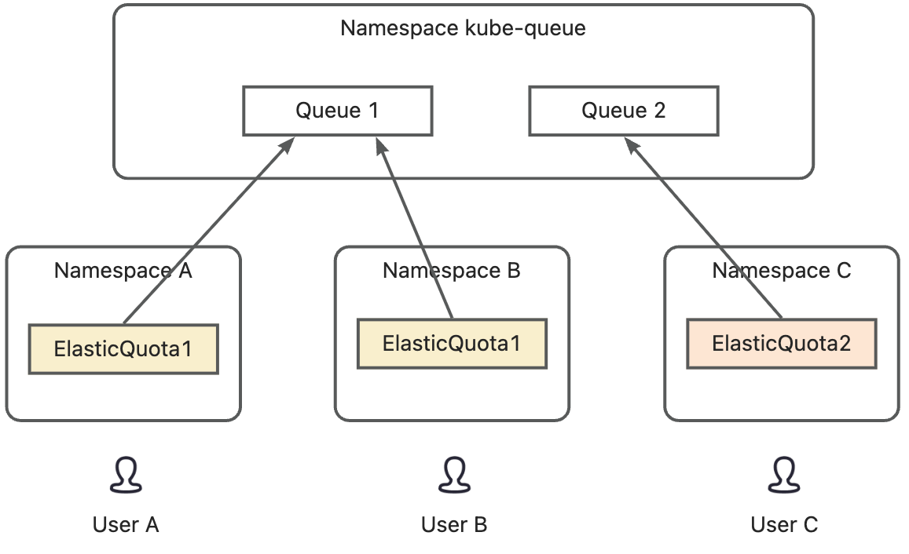
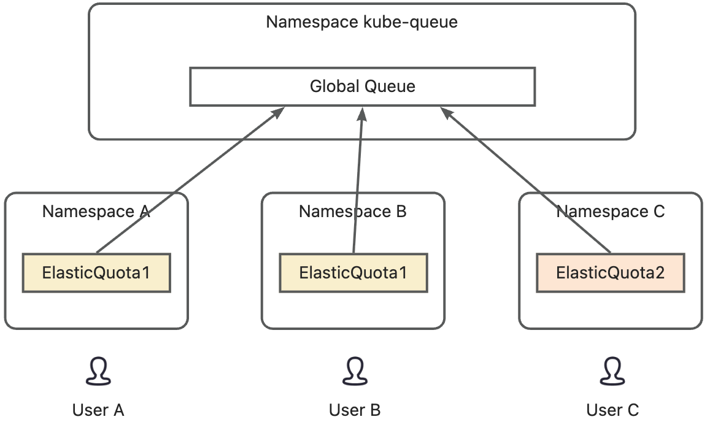

# Proposal: Support Job Queueing and Management in Koordinator

## Motivation

In multi-tenant or batch-heavy Kubernetes environments, efficient job queueing and prioritization is critical for resource fairness and system stability.
While Koordinator already provides advanced scheduling policies and resource management capabilities, it lacks native support for **structured job queueing** and **fine-grained priority management**. This proposal aims to integrate a robust queueing system inspired by [kube-queue](https://github.com/kubernetes-sigs/kube-queue) to address the following needs:

*   **Orderly job execution**: Ensure jobs are processed in a predictable sequence based on user-defined rules.
    
*   **Priority-based scheduling**: Prevent low-priority workloads from starving high-priority tasks.
    
*   **Job lifecycle management:** Manage job's lifecycle.
    
*   **Job-level resource checking:** Support check resource in queue to avoid too many pods in scheduler.

## Problem Description

*   My company provide AI model training platform for users. Users submit training jobs to the platform and pay for the resources. There will be a lot of pods in the cluster and cause some problems like system components OOM. Too many unschedulable pods will also cost many schedule cycles which leads to the high schedule latency. So I need to use a queue component to reduce the number of pods in the cluster. 
    
*   As a cluster maintainer, I already use Koord-Scheduler as the default scheduler and ElasticQuota as the quota system in the cluster, so it is better not to import another quota system. I hope there is a queue component which support to use ElasticQuota as the queue compoenent.
    
*   As a cluster maintainer, I found that if I increase PodMaxBackofSeconds, scheduler can handle more pods in queue but the priority is more probable to be broken. I hope all the jobs in the cluster can be scheduled by the FIFO or priority policy. 

## User Story
    
1. Create different quotas for each department in the company, all developers in the department share the quota. Jobs submited by the developers in same department should be queued in one queue, and vice versa.



2. Create different quotas for each department in the company, all developers in the department share the quota. Jobs submited by all developers should be queued in one queue. This is useful when each user has its quota limits and all users need to be queued in one queue.



## Goals

*   Implement a declarative API (`Queue` CRD) for defining job queues with priority.
    
*	Implement a queue controller to manage the jobs based on queue settings. 

*   Integrate with Koordinator's scheduler to enforce queue-based ordering and resource allocation.
    

## Non-Goals

*   Reimplement core Kubernetes scheduling logic (leverage existing Koordinator scheduler extensions).
    
*   Replace existing Koordinator scheduling policies (e.g., `Descheduling`, `Eviction`) with queue-centric logic.
    
## Relationship with Scheduler and Other Queue Componenets

- Koord-Scheduler

Koord-Queue complements the Kubernetes Scheduler in the scheduling system by performing an initial scheduling pass on Jobs before the Kubernetes Scheduler schedules Pods, thereby reducing the scheduler’s workload and pressure.

- Kueue

Kueue is a popular open-source job queuing system in the community. It provides its own independent quota and queueing system, but currently cannot integrate with ElasticQuota out of the box. Koord-Queue has a similar positioning to Kueue and aims to improve Kueue’s flexibility in multi-queue policies and quota adaptation. Koord-Queue offers a more flexible quota adaptation framework and extensible queue-policy interfaces, natively supports integration with ElasticQuota, and makes it easier to integrate with the Koordinator ecosystem.

|                  | Koord Queue                                         | Kueue                                               |
|------------------|-----------------------------------------------------|-----------------------------------------------------|
| APIs             | Queue, QueueUnit, AdmissionCheck                    | ClusterQueue, LocalQueue, Workload, ResourceFlavor, Cohort, AdmissionCheck |
| Quota Management | ElasticQuota                                        | ClusterQueues and Cohort                            |
| Quota Framework  | Support                                             | Not support                                         |
| Queue Management | 1. Default Queue is created when ElasticQuota is created <br>2. Create other Queues manually | Create LocalQueues manually  |
| Submit Jobs to Queues | Add labels in jobs to submit jobs in a certain queue | Add labels in jobs to submit jobs in a certain queue |
| Queue Policies   | Priority Blocking / Priority Non-Blocking + Framework  | Priority Blocking                                |
| Multi Queue      | Create different goroutine for scheduling           | One goroutine to traverse all queues |


## Design Overview

### Quotas and Queues

In a scheduling system, a quota is used to limit the resources that a user or a group of users can consume, while a queue serves as the entity for job  management and determines the order in which jobs are scheduled. In Koord-Queue, quotas and queues are not strongly bound. In most cases, each quota corresponds to a dedicated queue, meaning that jobs submitted by users under different quotas are enqueued separately and therefore do not affect each other’s scheduling.

In some special cases, as shown above in user story 2, multiple quotas can share the same queue. This means jobs in the queue may have different resource limits while sharing the same priority context. For example, when full-time employees and interns submit jobs to the same queue, administrators may want interns to have a lower resource limit than full-time employees, so interns and employees are assigned different quotas. Since they use the same pool of machines for the same type of work, they submit to the same queue. In this case, the relationship between quotas and queues becomes many-to-one.

In Koord-Queue, each job can specify the quota it uses and the queue it is submitted to via labels and annotations, depending on business needs. If not specified, the quota defaults to the one associated with the namespace, and the queue defaults to the quota’s associated default queue.

### API

The design introduces `**Queue**` **and** `**QueueUnit**` as the central abstractions for job queueing. And koord-queue support ElasticQuota and ElasticQuotaTree as its quota system.

`QueueUnit`is the scheduling unit of Koord-Queue. The QueueUnit for a certain job is created when the job of supported kind is submitted. The pod templates in job will be copied into the QueueUnit for scheduling. And the priority will be derived from the first role in the pod templates.

| Current Phase | Next Phase | Reason | Operator |
| --- | --- | --- | --- |
|  | Enqueued | Schedule fail | Koord Queue Controller |
| Enqueued | Dequeued | Schedule success | Koord Queue Controller |
| Enqueued | Reserved | Schedule success and need some checks by third-party systems | Koord Queue Controller |
| Reserved | Dequeued | Admission check success | Koord Queue Controller |
| Dequeued | Running | Job running | Koord Queue Controller |
| Dequeued | Backoff | Wait job running timeout | Job Extensions |
| Backoff | Enqueued | Backoff timeout | Job Extensions |
| Running | Succeed/<br>Failed | Job completed | Job Extensions |

```go
type QueueUnit struct {
	metav1.TypeMeta   `json:",inline"`
	metav1.ObjectMeta `json:"metadata,omitempty" protobuf:"bytes,1,name=metadata"`

	Spec   QueueUnitSpec   `json:"spec,omitempty" protobuf:"bytes,2,name=spec"`
	Status QueueUnitStatus `json:"status,omitempty" protobuf:"bytes,3,opt,name=status"`
}

// QueueUnitSpec defines the desired state of QueueUnit
type QueueUnitSpec struct {
	ConsumerRef *corev1.ObjectReference
	Priority    *int32 
	Queue       string 
	// podSets is a list of sets of homogeneous pods, each described by a Pod spec
	// and a count.
	// There must be at least one element and at most 8.
	// podSets cannot be changed.
	PodSets           []kueue.PodSet
    PriorityClassName string
    // deprecated
	Resource    corev1.ResourceList
	Request corev1.ResourceList 
}

type ReclaimState struct {
	Replicas int64 `json:"replicas" protobuf:"varint,2,opt,name=replicas"`
}

type Admission struct {
	Name      string
	Replicas  int64
	Resources corev1.ResourceList

	Running int64

	ReclaimState *ReclaimState
}

// QueueUnitStatus defines the observed state of QueueUnit
type QueueUnitStatus struct {
	Phase QueueUnitPhase
	Attempts int64
	Message        string
	LastUpdateTime *metav1.Time
	// admissionChecks list all the admission checks required by the workload and the current status
	AdmissionChecks []kueue.AdmissionCheckState 
    // resource admission, updated by Koord-Queue controller
	Admissions       []Admission
	LastAllocateTime *metav1.Time
    // deprecated
	PodState PodState
}

type PodState struct {
	Running int 
	Pending int
}

type QueueUnitPhase string

const (
	Enqueued     QueueUnitPhase = "Enqueued"
	Reserved     QueueUnitPhase = "Reserved"
	Dequeued     QueueUnitPhase = "Dequeued"
  
	Running      QueueUnitPhase = "Running"
	Succeed      QueueUnitPhase = "Succeed"
	Failed       QueueUnitPhase = "Failed"
	Backoff      QueueUnitPhase = "TimeoutBackoff"
)
```

`Queue`is the unit that koord-queue used to schedule the queueunits. QueueUnits will be inserted to the Queue bound to the Quota to which the QueueUnits belong by default. And QueueUnits can also be inserted to other Queues by using the annotation.

```go
// +genclient
// +k8s:deepcopy-gen:interfaces=k8s.io/apimachinery/pkg/runtime.Object
// +crd
// +kubebuilder:subresource:status
// +groupName=scheduling.x-k8s.io
type Queue struct {
	metav1.TypeMeta   `json:",inline"`
	metav1.ObjectMeta `json:"metadata,omitempty" protobuf:"bytes,1,name=metadata"`

	Spec   QueueSpec   `json:"spec,omitempty" protobuf:"bytes,2,name=spec"`
	Status QueueStatus `json:"status,omitempty" protobuf:"bytes,3,opt,name=status"`
}

// QueueSpec defines the desired state of Queue
type QueueSpec struct {
	QueuePolicy       QueuePolicy                  `json:"queuePolicy,omitempty" protobuf:"bytes,1,opt,name=queuePolicy"`
	Priority          *int32                       `json:"priority,omitempty" protobuf:"varint,2,opt,name=priority"`
	PriorityClassName string                       `json:"priorityClassName,omitempty" protobuf:"bytes,3,opt,name=priorityClassName"`
	AdmissionChecks   []AdmissionCheckWithSelector `json:"admissionChecks,omitempty" protobuf:"bytes,4,opt,name=admissionChecks"`
}

type AdmissionCheckWithSelector struct {
	Name string `json:"name,omitempty" protobuf:"bytes,1,opt,name=name"`
	Selector *metav1.LabelSelector `json:"labelSelector,omitempty" protobuf:"bytes,2,opt,name=labelSelector"`
}

// QueueStatus defines the observed state of Queue
type QueueStatus struct {
	QueueItemDetails map[string][]QueueItemDetail `json:"queueItemDetails,omitempty" protobuf:"bytes,1,opt,name=queueItemDetails"`
}

type QueueItemDetail struct {
	Name      string `json:"name,omitempty" protobuf:"bytes,1,opt,name=name"`
	Namespace string `json:"namespace,omitempty" protobuf:"bytes,2,opt,name=namespace"`
	Priority  int32  `json:"priority,omitempty" protobuf:"varint,3,opt,name=priority"`
	Position  int32  `json:"position,omitempty" protobuf:"varint,4,opt,name=position"`
}

// +k8s:openapi-gen=true
// QueuePolicy defines the queueing policy for the elements in the queue
type QueuePolicy string

const (
	QueuePolicyFIFO     QueuePolicy = "FIFO"
	QueuePolicyPriority QueuePolicy = "Priority"
)

```

### Components

Key components include:

1.  **Queue Scheduler**: Create queues and schedule the queueUnits.
    
2.  **Job Extensions**: Controllers that create, update the queueUnits and jobs.
    

The architecture of Koord Queue is shown in the following figure (The light blue-filled rounded rectangle represents the part that will not be open-sourced and will be removed in community proposal):


QueueUnit Controller is responsible for creating QueueUnits when the jobs are created. And resume the jobs when Queue Controller admits the QueueUnits.

Resource Report Controller watch the running pods, count the real-time usage for each job and update the real-time usage to the QueueUnit status.  
These two components can also be deployed in one controller or pod.

### Details

**schedule framework**

```go
type QueueStatusUpdateHandle interface {
	UpdateQueueStatus(name string, details map[string][]v1alpha1.QueueItemDetail) error
}

type Handle interface {
	QueueStatusUpdateHandle
	QueueInformerFactory() externalversions.SharedInformerFactory
	SharedInformerFactory() informers.SharedInformerFactory
	KubeConfigPath() string
	QueueUnitClient() versioned.Interface
	OversellRate() float64
	KubeConfig() *rest.Config
	EventRecorder() record.EventRecorderLogger
	GetQueueUnitQuotaName(*v1alpha1.QueueUnit) ([]string, error)
}

type MultiQueueHandle interface {
	Handle
	QueueUnitMappingFunc() QueueUnitMappingFunc
}

type Framework interface {
	MultiQueueHandle
	RunFilterPlugins(context.Context, *QueueUnitInfo) *Status
	RunScorePlugins(context.Context) (int64, bool)
	RunReservePluginsReserve(context.Context, *QueueUnitInfo) *Status
	RunReservePluginsUnreserve(context.Context, *QueueUnitInfo)
	RunReservePluginsResize(context.Context, *QueueUnitInfo, *QueueUnitInfo)
	StartQueueUnitMappingPlugin(ctx context.Context)
	RegisterApiHandler(engine *gin.Engine)
	GetQueueUnitInfoByQuota(quota string) ([]apiv1alpha1.QueueUnit, error)
}

type Status struct {
	message string
	code    Code
}
```

**queue policy**

```go
type SchedulingQueue interface {
	// return the next queueUnit in the queue but do not update nextId
	Top(context.Context) *framework.QueueUnitInfo
	// Next will be called to get the next queueUnit to be scheduled.
	// Next should blocked if no more queueUnit to be scheduled.
	Next(context.Context) (*framework.QueueUnitInfo, error)
	// AddQueueUnitInfo will be called when new queueUnit is added to the queue.
	AddQueueUnitInfo(*framework.QueueUnitInfo) (bool, error)
	// Delete will be called when queueUnits are delete, or the queueUnits change to another queue.
	Delete(*v1alpha1.QueueUnit) error
	// Update will be called when queueUnits are updated.
	Update(*v1alpha1.QueueUnit, *v1alpha1.QueueUnit) error
	// Reserve will be called when a queueUnit is scheduled
	Reserve(ctx context.Context, qi *framework.QueueUnitInfo) error
	Preempt(ctx context.Context, qi *framework.QueueUnitInfo) error
	// AddUnschedulableIfNotPresent will be call when a queueUnit is unschedulable, allocatableChangedDuringScheduling
	// indicates whether there is a quota change during the scheduling.
	AddUnschedulableIfNotPresent(ctx context.Context, qi *framework.QueueUnitInfo, allocatableChangedDuringScheduling bool) error
	// List() should return all queueUnits in this queue.
	List() []*framework.QueueUnitInfo
	// Fix will be called when quota info is changed. Queue should determine whether the queueUnit should be moved to
	// another queue.
	Fix(framework.QueueUnitMappingFunc) []*framework.QueueUnitInfo
	// SupportedPolicy return the supported policy of this queue.
	SupportedPolicy() []string
	ChangePolicy(old, new string)
	UpdateQueueCr(new *v1alpha1.Queue)
	// SortedList will be called every xxx seconds.
	// key of returned map is the kind of queue
	// value of returned map is the list of sorted jobs
	SortedList(scheduling ...*framework.QueueUnitInfo) map[string][]v1alpha1.QueueItemDetail

	// Start the queue
	Run()
	Close()
	// Debug endpoint.
	GetQueueDebugInfo() QueueDebugInfo
	GetUserQuotaDebugInfo() UserQuotaDebugInfo
	// Complete() will be called when queueUnitInfo is required by a RESTful api.
	Complete(*apiv1alpha1.QueueUnit)
}
```

##  Test Plan

*   **Unit Tests**: Validate queue admission logic and priority comparisons.
    
*   **E2E Tests**: Simulate multi-queue scenarios with varying priorities and resource constraints.
    
*   **Load Tests**: Stress-test queue throughput and backpressure handling.
    

##  Future Work

*   **Advanced Scheduling Policies**
    
*   **Integration with Koord-scheduler**: Explore synergy with koord-scheduler to support fine grained dequeue ability.