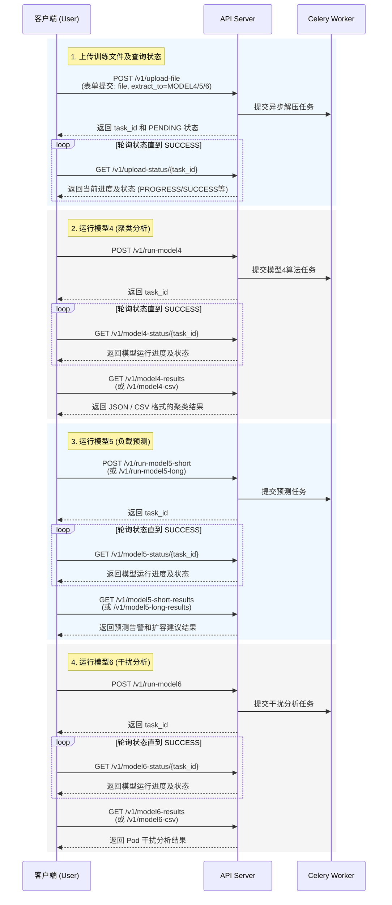

# 模型推理服务 API 调用流程

本文档详细说明了调用模型推理服务进行数据上传、状态查询、模型运行及结果获取的完整流程。

## 完整业务流程时序图

以下时序图展示了用户与系统交互的全过程：

## 详细 API 接口说明

### 1. 文件上传与查询
- **上传文件**
  - **接口**: `POST /v1/upload-file`
  - **参数**: 
    - `file`: 上传的压缩文件（支持 `.7z`, `.tar`, `.gz`）。
    - `extract_to`: 数据要分配给哪个模型使用（枚举值：`MODEL4`, `MODEL5`, `MODEL6`）。
    - `cleanup_archive`: 可选参数，是否解压后删除原压缩包，默认为 True。
  - **返回**: 包含 `task_id` 的状态对象，可用于后续轮询。

- **查询文件上传/解压状态**
  - **接口**: `GET /v1/upload-status/{task_id}`
  - **说明**: 需要根据前一步获取到的 `task_id` 进行轮询，当返回 `status` 为 `SUCCESS` 表示文件解压及准备已就绪。

---

### 2. 模型四：Pod 聚类分析
- **执行模型**
  - **接口**: `POST /v1/run-model4`
  - **说明**: 自动使用 `/upload-file` 到 MODEL4 的最新数据，返回执行算法的 `task_id`。
- **查询状态**
  - **接口**: `GET /v1/model4-status/{task_id}`
  - **说明**: 轮询查询该任务执行进度（如提取指标、计算指标、进行聚类）。
- **获取结果**
  - **接口**: 
    - `GET /v1/model4-results` （查询 JSON 结果）。
    - `GET /v1/model4-csv` （下载 CSV 结果文件）。
  - **说明**: 支持带上 `?task_id=...` 查询特定任务结果，不带则返回最新一次的成功结果。

---

### 3. 模型五：Pod 中期/长期负载预测
- **执行模型**
  - **接口**:
    - `POST /v1/run-model5-short` (中期 90 分钟预测)
    - `POST /v1/run-model5-long` (长期 24 小时预测)
  - **说明**: 自动拉取 MODEL5 目录下最新的数据，返回 Celery 的 `task_id`。
- **查询状态**
  - **接口**: `GET /v1/model5-status/{task_id}`
  - **说明**: 中长期预测通用此接口查询执行进度（如清洗、LSTM 训练、回测）。
- **获取结果**
  - **接口**: 
    - 获取 JSON: `GET /v1/model5-short-results` 或 `GET /v1/model5-long-results`。
    - 下载 CSV: `GET /v1/model5-short-csv` 或 `GET /v1/model5-long-csv`。
  - **说明**: 同样支持可选的 `task_id` 查询特定执行结果，返回包含目标副本数推荐和告警预测的信息。

---

### 4. 模型六：Pod 维度干扰分析
- **执行模型**
  - **接口**: `POST /v1/run-model6`
  - **说明**: 系统自动使用已准备在 MODEL6 目录下的数据创建干扰分析任务，返回 `task_id`。
- **查询状态**
  - **接口**: `GET /v1/model6-status/{task_id}`
  - **说明**: 轮询查询干扰分析（包含背景压力、CPI/PSI异常检测、双路径分析及回测）任务的进度。
- **获取结果**
  - **接口**: 
    - `GET /v1/model6-results` （查询 JSON 结果）。
    - `GET /v1/model6-csv` （下载 CSV 结果文件）。
  - **说明**: 返回干扰等级、引发干扰的根因信号及优化建议等数据。
